

  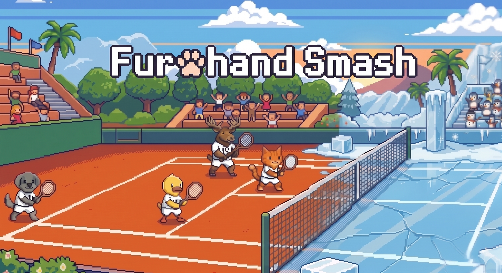
   
  <a href="https://uob-comsm0166.github.io/2026-group-21/" target="_blank"><b>🎮 CLICK HERE TO PLAY FUR-HAND SMASH 🎮</b></a> 

  <a href="https://www.youtube.com/watch?v=aB3WzAM6GVw" target="_blank"><b>🎾 CLICK HERE TO WATCH DEMO VIDEO 🎾</b></a> 

# Table of Contents
- [1. Development Team](#1-development-team)
- [2. Introduction](#2-introduction)
- [3. Requirements](#3-requirements)
- [4. Design](#4-design)
- [5. Implementation](#5-implementation)
- [6. Evaluation](#6-evaluation)
- [7. Process](#7-process)
- [8. Sustainability, ethics and accessibility](#8-sustainability-ethics-and-accessibility)
- [9. Conclusion](#9-conclusion)
- [10. AI statement](#10-ai-statement)
- [11. Contribution Statement](#11-contribution-statement)
- [12. References](#12-references)

# 1. Development Team

  <b>Figure 1:</b>
  <i>Development Team</i>
   
  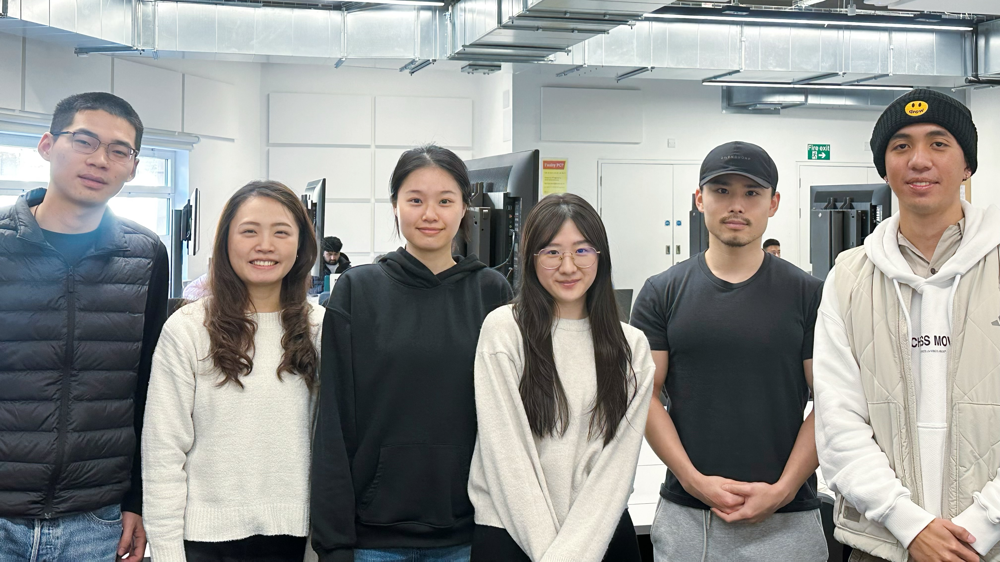

  <b>Table 2:</b>
  <i>Team Member Description</i>
   

| NAME                  | EMAIL                 | ROLE                             |
| --------------------- | --------------------- | -------------------------------- |
| Xian Li               | yd25988@bristol.ac.uk |Lead Architect & Physics Developer|
| Yu-Han Sun            | qv25088@bristol.ac.uk |Art & Sound Developer             |
| Yu-Chun Chen          | df25142@bristol.ac.uk |UI/UX Developer                   |
| Yujing Shen           | pf25516@bristol.ac.uk |Gameplay Developer                |
| Panarin Thipboonthong | uk25559@bristol.ac.uk |Gameplay Developer                |
| Koki Fushiya          | bz25385@bristol.ac.uk |AI Developer & Testing            |

# 2. Introduction
Fur-hand Smash is a top-down 2.5D 1v1 tennis game inspired by genre classics like *Super Tennis* and *Mario Tennis*. As a team of fans who love the sport, we wanted to take the competitive spirit of real-world tennis and pack it into an arcade-style format.

We kept the mechanics simple to ensure matches stay fast-paced. Instead of wrestling with complex inputs, players just need to focus on positioning and the timing of their hits, serves, and special skills. Winning a point is all about catching your opponent off-guard or driving the ball past them, and the first player to reach the target score wins the match.

Everything runs on a custom physics system we built to find a sweet spot between realistic ball movement and arcade fun. This logic handles everything in our local multiplayer and single-player modes. To keep things interesting, we added two main gameplay twists:

- **Skill System:** Each character has a unique ability to add a layer of strategy to the 1v1 matches. These active skills allow for tactical advantages, ranging from instant movement to ball manipulation:

  <b>Table 3:</b>
  <i>Character Skill Sets Overview</i>

|Character|Image|Skill|Skill Icon|Description|
|:-|:-|:-|:-|:-|
|**Cat**||Shadow Teleport|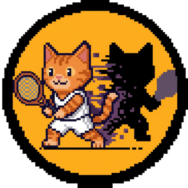|Instantly teleports the character directly in front of the ball.|
|**Dog**||Giga Ball|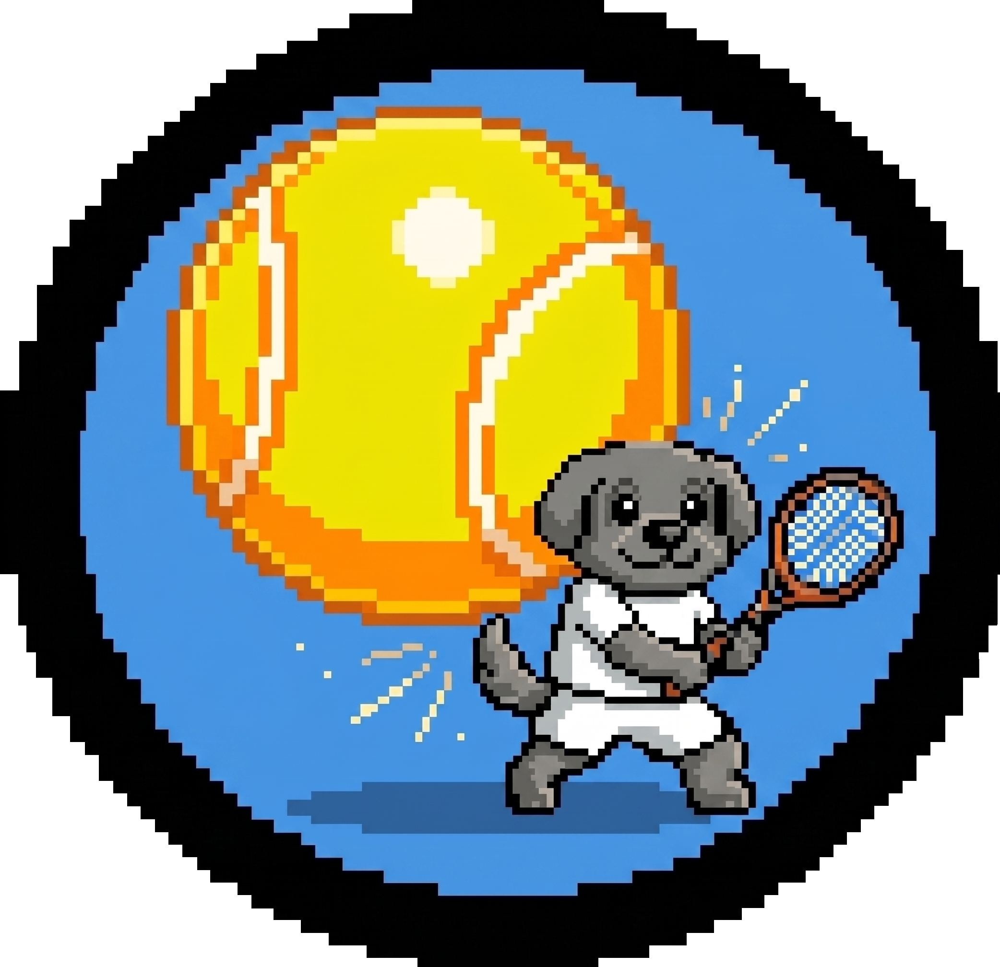|Hits a massive ball that increases the hit area and stuns the opponent.|
|**Deer**||Forest Zen||Launches a slow-speed ball to disrupt the opponent's timing.|
|**Bird**||Feather Storm|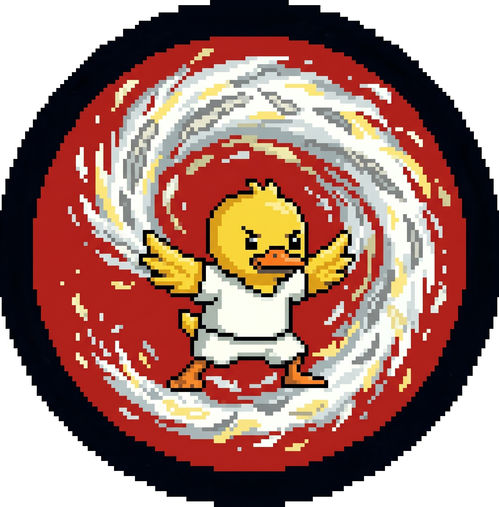|Shrinks the ball while significantly increasing its velocity.|

  <b>Figure 4:</b>
  <i>Demonstration of Dog's 'Giga Ball' skill</i>
   
  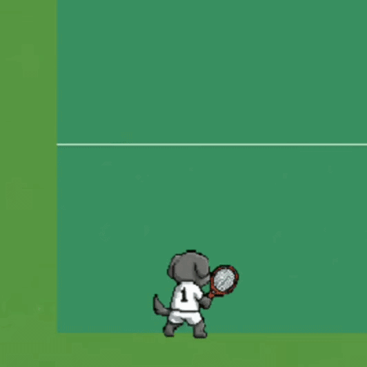

- **Dynamic Environments:** We designed different courts with unique environmental hazards. The court itself acts as a variable, forcing players to change how they move and time their shots based on the map's mechanics:

  <b>Table 5:</b>
  <i>Maps Overview</i>

|Map|Image|Map Effect|
|:-|:-|:-|
|**Polar**|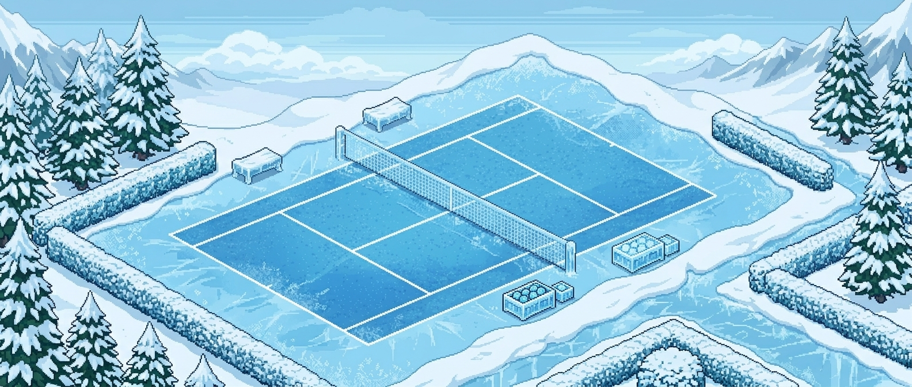|Features a frozen court that significantly reduces friction.|
|**Egypt**||Triggers random sandstorms. These wind gusts apply force to the ball's trajectory.|
|**Wimbledon**|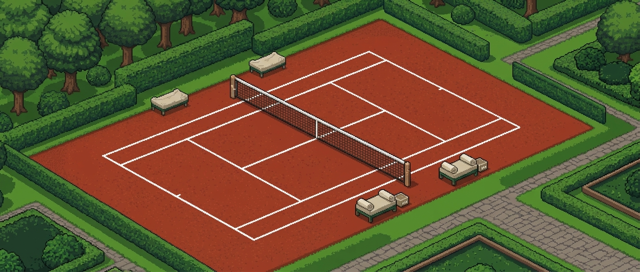|A classic grass court with no environmental hazards.|

  <b>Figure 6:</b>
  <i>Demonstration of Wind Affecting Ball Trajectory</i>
   
  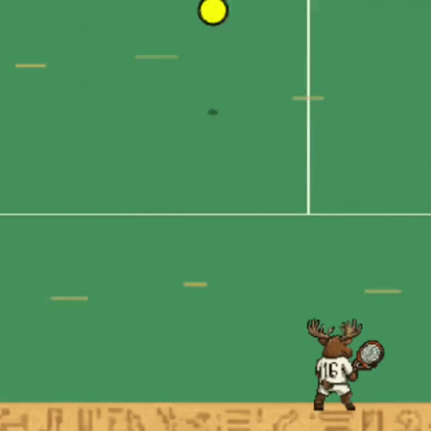

    

# 3. Requirements 
## Ideation Process
Our first brainstorming produced many ideas, but we were concerned about what we could realistically build with p5.js. After researching independently, we shared concepts in a [Google Doc](https://docs.google.com/document/d/1nrocSGf6uqzb97ttsJxpVtYdhJrd-7BKs9r7RD0a1_Y/edit?usp=sharing), each including potential challenges and a unique 'twist'. Interestingly, three of us proposed similar ball-sports games. After a group vote, we narrowed the candidates down to two: the Tennis game and a Vampire Survivors-style project.

## Early Stages Design
We researched similar games on Google and Steam to benchmark visuals and mechanics. These insights informed our Week 3 workshop and follow-up sessions, where we built paper prototypes for our top two concepts to compare their viability.

Workshop feedback confirmed the tennis game as the crowd favourite. Since our team shares a passion for sports, we found the tennis project more intuitive and fleshed-out during the prototyping stage. This external feedback, combined with our own enthusiasm, made it an easy choice to officially move forward with the tennis game.

Prototyping also forced us to address game flow and revealed disagreements regarding how realistic the rules should be. To resolve these, we turned to User Stories and Use Case modelling, which helped us formalise system requirements and ensure the entire team shared the same vision.

  <b>Figure 7:</b>
  <i>Tennis Game Paper Prototype </i> 
  <a href="https://www.youtube.com/watch?v=qdplPSo7CMk" target="_blank">Watch it on YT for full audio-visual feedback</a> 
  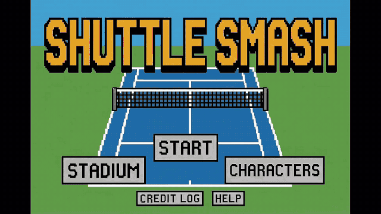

  <b>Figure 8:</b>
  <i>Vampire Survival Paper Prototype </i> 
  <a href="https://www.youtube.com/watch?v=HRUYlSV_QAU" target="_blank">Watch it on YT for full audio-visual feedback</a> 
  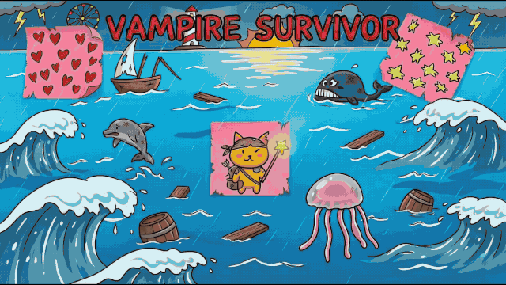

## Stakeholders
To better understand our project's scope, we mapped our stakeholders using Ian Alexander’s onion model (2005). As illustrated in Figure 9, our team acts as the primary operators, while the gamers are our core 'beneficiaries' - it’s their needs that ultimately drive our requirements. We also recognise our markers as functional operators during the evaluation phase. They play a 'surrogate role' by representing the high professional standards we aim to meet. Because both players and markers are essential to the game's operational success and final validation, we’ve categorised them within the 'containing system' of the project.

  <b>Figure 9:</b>
  <i>Onion Model for Stakeholders (Adapted from Alexander, 2005) </i> 
  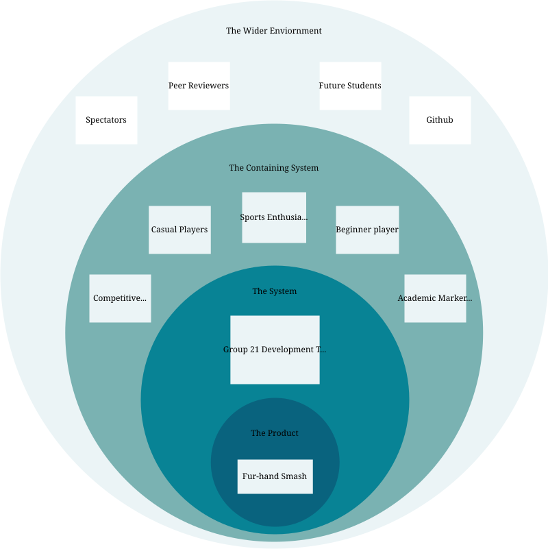

## User Stories
We started with plenty of [User Story ideas](https://docs.google.com/document/d/1LYooThDOOa3G9zB3lg5oMovLOXHKsaj8kRKYu5YS_vA/edit?usp=sharing), but we knew we couldn't build everything in the time we had. To stay on track, we applied MoSCoW framework (Agile Business Consortium, 2014) to rank our requirements and used Planning Poker (Cohn, 2005) to estimate how long each part would take to develop. This structured approach made it much easier to see where our time was going and allowed us to cut back on lower-priority features. The following User Stories represent the final set we chose for implementation:

  <b>Table 10:</b>
  <i>User Stories</i>
   
  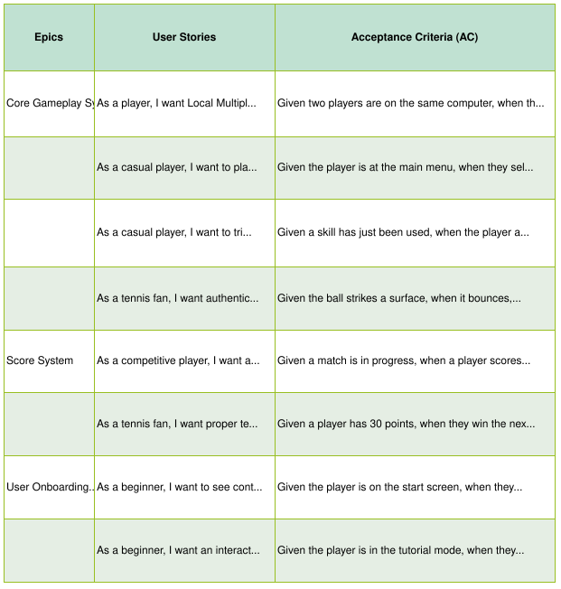

## Use-Case Diagram
After defining our User Stories, we developed a Use Case Diagram (Figure 11) to help us visualise how these requirements would actually function within the system. This process was a great way to map out the game's functional boundaries more clearly. For example, by establishing an << include >> relationship between 'Hit Ball' and 'Calculate Ball Physics', we explicitly acknowledged a key technical dependency. It made the team realise that the physics engine wasn't just a feature to be added later, but the very foundation of the core gameplay loop that had to be prioritised from the start.

      <b>Figure 11:</b>
      <i>Use-Case Diagram </i>
       
      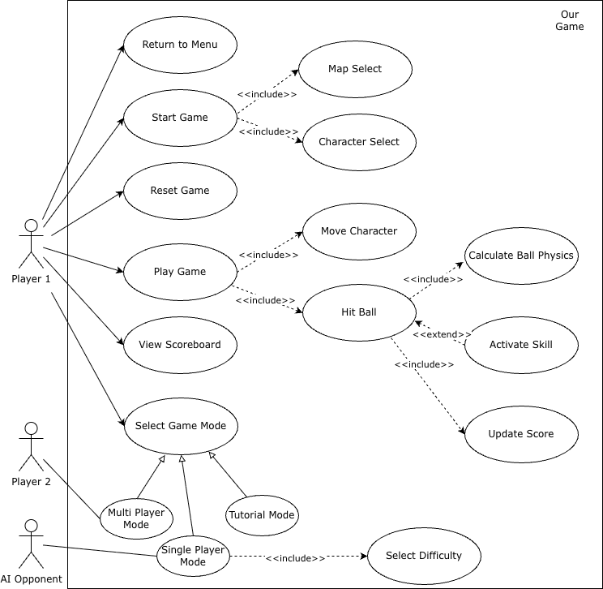
    

## Reflection
We quickly found that our Use Case Diagrams and User Stories weren't just things we finished at the start and set aside. Instead, they became living documents that we kept coming back to. As we moved into the implementation phase, our hands-on experience with the code gave us a much sharper technical understanding of the game. This meant we were constantly refining our requirements to make sure they stayed accurate and provided a reliable baseline for our testing.

The workshop was a huge turning point for us. The real eye-opener came when we were watching other teams demo their projects, we realised how frustrating it was to watch a game and have no clue how it worked or what the buttons did. This made us look back at our own design with fresh eyes. We realised we’d fallen into the 'Expert Bias' trap: because we were the ones building the game, the controls felt obvious to us, but they would be a total mystery to a new player. This convinced us to move the User Onboarding System to the top of our list.

Prioritising the player experience led to our toughest decision: scrapping the online multiplayer. While we were excited about the feature, our Planning Poker session provided a necessary reality check. The estimates showed that forcing complex networking into our limited timeframe would risk project stability. We chose to drop this ambition to protect our 'Must-haves', specifically the physics engine and the local 1v1 mode. This trade-off allowed us to stop overextending and focus on perfecting the core gameplay.

# 4. Design
## System Architecture
We structured our project using a Scene-Based Finite State Machine (FSM) to keep the game phases decoupled and easier to maintain.

**System Loop:** `sketch.js` serves as the entry point, holding the global `currentState`. The main `draw()` loop acts as a dispatcher, delegating logic and rendering to specific scenes like `Scene_Menu` or `Scene_Game`. This kept our main loop clean even as the project grew in complexity.

**Entity Logic:** Core entities, such as the `Player` and `Ball`, encapsulate their own movement and rendering logic. We use `Scene_Game` as the central coordinator to manage their lifecycles and high-level interactions, such as triggering collision checks at the appropriate time in the game loop.

**Managers:** To handle global tasks, we implemented specialised Manager classes. This allows our entities to focus strictly on their own behaviours. For example, `SoundManager` handles all audio triggers, while `MapManager` and `SkillManager` govern environmental rules and ability logic, respectively.

## Class Diagrams
Our system design evolved as we prioritised both gameplay functionality and long-term maintainability. Initially, we designed a strict inheritance hierarchy (Figure 12). We used an abstract `Player` class to handle core movement and mechanics, while leaving specific abilities to the `Cat` and `Dog` subclasses.

  <b>Figure 12:</b>
  <i>Early Class Diagram</i> 
  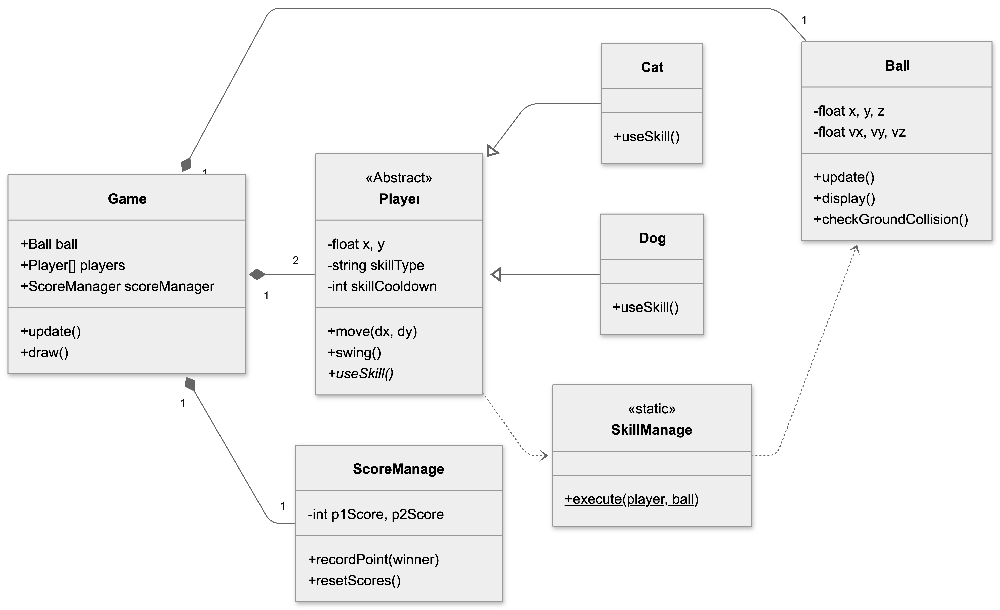

However, as gameplay grew in complexity, we realised this inheritance-heavy approach could lead to code duplication and a rigid structure. To address these challenges, we transitioned to a more modular architecture (Figure 13). This shift allowed us to decouple character logic from global game rules, significantly improving the system's extensibility.

**Player:** Instead of using traditional inheritance, we implemented a single `Player` class. Character identities, such as `charName`, `skillType`, and visual assets, are assigned dynamically by indexing into the `GAME_CONFIG.CHARACTERS` object. This data-driven approach prevents class explosion and allows for adding new characters via configuration rather than modifying source code.

**AI:** To avoid code duplication, the `AI` class uses Composition (a 'has-a' relationship) rather than subclassing `Player`. It holds a reference to a `Player` instance and manipulates its inputs. This design allows the same `Player` class to be controlled seamlessly by either a human or an algorithm.

**SkillManager:** Implemented as a static utility, this class encapsulates the logic for special abilities (e.g., `SHADOW_TELEPORT`, `GIGA_BALL`). The `Player` class delegates skill execution to this manager, making the system highly extensible for future ability types without cluttering the core entity classes.

**Scene_Game:** `Scene_Game` acts as the root of the gameplay session, coordinating the interactions between the `Player`, `Ball`, and global systems like the `ScoreManager` and `MapManager`.

  <b>Figure 13:</b>
  <i>Final Class Diagram</i> 
  

View interactive diagram

```mermaid
classDiagram
    class Game {
        +player : Player
        +opponent : Player
        +ball : Ball
        +opponentAI : AI
        +scoreManager : ScoreManager
        +layout : LayoutManager
        +soundManager : SoundManager
        +currentState : String
        +preload() : void
        +setup() : void
        +draw() : void
        +keyPressed() : void
        +mousePressed() : void
        +windowResized() : void
    }

    class Player {
        +x : Number
        +y : Number
        +speed : Number
        +swingTimer : Number
        +skillCooldown : Number
        +isBottom : Boolean
        +isAI : Boolean
        +skillType : String
        +shotModifier : Function
        +update() : void
        +display() : void
        +swing() : void
        +handleInput() : void
        +handleKeyPress(keyCode : Number, ball : Ball) : void
        +applyConstraints() : void
        +useSkill(ball : Ball) : void
    }

    class Ball {
        +x : Number
        +y : Number
        +z : Number
        +vx : Number
        +vy : Number
        +vz : Number
        +lastHitter : Player
        +isWaiting : Boolean
        +isTossing : Boolean
        +update() : void
        +display() : void
        +toss() : void
        +checkHit(p : Player) : void
        +terminateRound(winner : String) : void
        +applyPhysics() : void
    }

    class AI {
        +player : Player
        +personality : String
        +difficulty : String
        +speedMult : Number
        +reactionDelay : Number
        +errorRange : Number
        +prediction : Number
        +vx : Number
        +vy : Number
        +update(ball : Ball) : void
        +setPersonality(personality : String) : void
        +applySmoothMovement() : void
        +handleActions(ball : Ball) : void
        +updateTargetY(ball : Ball) : void
        +applyPersonalityShotModifier(ball : Ball) : void
    }

    class ScoreManager {
        +playerPoints : Number
        +opponentPoints : Number
        +playerGames : Number
        +opponentGames : Number
        +isMatchOver : Boolean
        +currentServer : String
        +init() : void
        +recordPoint(winner : String) : Boolean
        +prepareNextPoint() : void
        +checkGameWin() : Boolean
        +getDisplayScore() : String
        +displayGameOver() : void
    }

    class LayoutManager {
        +VIRTUAL_W : Number
        +VIRTUAL_H : Number
        +scaleFactor : Number
        +courtLeft : Number
        +courtRight : Number
        +courtTop : Number
        +courtBottom : Number
        +netY : Number
        +update() : void
    }

    class SkillManager {
        <<static>>
        +execute(p : Player, ball : Ball) : void
        +triggerHitSkill(p : Player, ball : Ball) : void
        +shadowTeleport(p : Player, ball : Ball) : void
        +gigaBall(ball : Ball) : void
        +featherStorm(ball : Ball) : void
        +forestZen(ball : Ball) : void
    }

    class MapManager {
        +windForce : Number
        +currentWindActive : Number
        +p1Vel : Object
        +p2Vel : Object
        +update(player : Player, opponent : Player, ball : Ball) : void
        +handleEgyptWind(ball : Ball) : void
        +handlePolarIce(p1 : Player, p2 : Player) : void
        +draw() : void
        +reset() : void
    }

    class SoundManager {
        +sounds : Object
        +sfxVolume : Number
        +loadSounds() : void
        +updateBGM(state : String) : void
        +play(soundName : String) : void
        +setMasterVolume(vol : Number) : void
        +transitionTo(bgmKey : String) : void
    }

    class TutorialManager {
        +currentStep : Number
        +successCount : Number
        +targetCount : Number
        +targetX : Number
        +targetY : Number
        +getStepIntro() : Object
        +getCurrentPrompt() : String
        +registerSuccess() : void
        +nextStep() : void
        +hasTarget() : Boolean
    }

    class Scene_Game {
        <<singleton>>
        +setup() : void
        +draw() : void
        +handleInput() : void
        +restartGame() : void
        +nextRound() : void
        +drawCircularSkillUI() : void
    }

    class Scene_Menu {
        <<singleton>>
        +draw() : void
        +handleInput() : void
        +handleMouse() : void
    }

    class Scene_CharSelect {
        <<singleton>>
        +draw() : void
        +handleInput() : void
        +handleMouse() : void
    }

    class Scene_DifficultySelect {
        <<singleton>>
        +draw() : void
        +handleInput() : void
        +handleMouse() : void
    }

    class Scene_MapSelect {
        <<singleton>>
        +draw() : void
        +handleInput() : void
        +handleMouse() : void
    }

    class Scene_Pause {
        <<singleton>>
        +draw() : void
        +handleInput() : void
        +handleMouse() : void
    }

    class Scene_Tutorial {
        <<singleton>>
        +isDevMode : Boolean
        +setup() : void
        +draw() : void
        +handleInput() : void
        +jumpToStep(step : Number) : void
        +drawDevMenu() : void
    }

    Game "1" --> "2" Player
    Game "1" --> "1" Ball
    Game "1" --> "0..1" AI
    Game "1" --> "1" ScoreManager
    Game "1" --> "1" LayoutManager
    Game "1" --> "1" SoundManager

    Game "1" ..> "1" Scene_Game
    Game "1" ..> "1" Scene_Menu
    Game "1" ..> "1" Scene_CharSelect
    Game "1" ..> "1" Scene_DifficultySelect
    Game "1" ..> "1" Scene_MapSelect
    Game "1" ..> "1" Scene_Pause
    Game "1" ..> "1" Scene_Tutorial

    AI "1" --> "1" Player
    Ball "1" --> "0..1" Player

    Scene_Game "1" ..> "2" Player
    Scene_Game "1" ..> "1" Ball
    Scene_Game "1" ..> "1" ScoreManager
    Scene_Game "1" ..> "1" MapManager
    Scene_Game "1" ..> "1" SoundManager

    Scene_Tutorial "1" --> "1" TutorialManager

    Player "1" ..> "1" SkillManager
```

## Behavioural Diagrams
To illustrate the game's logic flow, we analysed the 'Ball Hit Detection' scenario (Figure 14), which is critical for the gameplay feel.

This process begins with the `Player` class listening for user input to trigger the `swing()` method, while the `Ball` object updates its physics state independently within the main game loop.

Hit detection is initiated through the `checkHit()` method. The system first performs an 'early exit' check by verifying if the player is currently swinging (`swingTimer` > 0) and if the ball is within the appropriate 3D height window ($Z-axis$). This ensures that collision logic only runs when a hit is physically possible.

Once the state is validated, the system evaluates the ball’s position against the player’s 2D coordinates and bounding box ($x, y, w, h$). This spatial check confirms whether the ball and the player's racquet area actually overlap on the court.

Upon a hit, the ball's trajectory ($v_x, v_y, v_z$) is reset using defined constants and contact point offsets. To prevent a single swing from hitting the ball multiple times, the system sets a `hasHit` flag to true, effectively locking the interaction until the next swing. 

Finally, the system triggers the appropriate sound effects to provide immediate auditory feedback.

  <b>Figure 14:</b>
  <i>Sequence Diagram: Ball Hit Logic</i>
   
  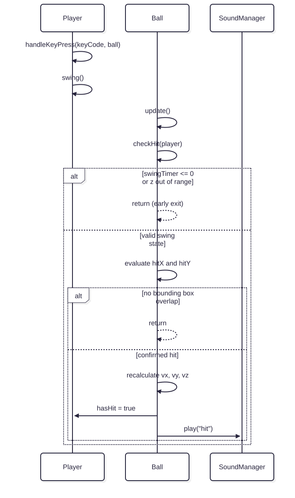

Employing UML diagrams was vital for organising our object-oriented ideas and establishing a shared architectural blueprint. To avoid the overhead of manual updates, we refined our documentation workflow from hand-drawn sketches to Mermaid. This transition to a text-to-diagram tool allowed our architectural models to evolve dynamically with the codebase. By treating documentation as a living component of our development, we ensured that these models remained both up-to-date and accessible, providing a clear technical reference for the game’s long-term maintenance.

# 5. Implementation
## **Challenge 1: Pseudo-3D Physics and Collision Handling**
The primary challenge was simulating a 3D tennis experience on a 2D canvas. We needed the ball to move realistically in space while ensuring that high-speed interactions remained accurate and fair.

### **Simulating 2.5D Trajectory**
To create the illusion of height, we introduced a $z$ variable to our coordinate system. The ball's vertical motion is governed by gravity ($g$), which updates its velocity and position in every frame:

$$z_{t+\Delta t} = z_t + v_{z,t} \cdot \Delta t$$

$$v_{z,t+\Delta t} = v_{z,t} - g \cdot \Delta t$$

To render this on a 2D screen, we projected the 3D coordinates $(x, y, z)$ into 2D screen space $(x', y')$ by offsetting the vertical position:

$$
\begin{cases}
x' = x \\
y' = y - z
\end{cases}
$$

This projection allows the ball to 'arc' through the air. We also implemented a dynamic shadow where its radius ($R_s$) decreases as the ball rises: $R_s(z) = \max(R_{base} - \alpha \cdot z, R_{min})$. This visual cue is essential for players to anticipate the landing point and timing.

### **Collision Detection**
Another challenge was ensuring the ball does not pass through the player when moving at high speeds between frames. To solve this, we utilised Axis-Aligned Bounding Box (AABB) detection. A collision is triggered only if the ball and player's boundaries overlap on both the $X$ and $Y$ axes:

$$X-axis: |B_x - P_x| < (B_{width} + P_{width}) / 2$$

$$Y-axis: |B_y - P_y| < (B_{height} + P_{height}) / 2$$

We also added a step to verify the ball's height ($z$), ensuring it is within the player's reach before a hit is confirmed. This, along with a `hasHit` flag to prevent duplicate hits in a single swing, makes the physics feel solid and consistent (Figure 15).

      <b>Figure 15:</b>
      <i>Demonstration of Ball Physics</i>
       
      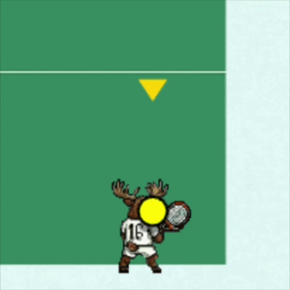

## **Challenge 2: Designing a Believable AI Opponent**
To create an AI that feels natural rather than robotic, we moved beyond simple tracking logic to implement a system that accounts for physics, personality, and scalable difficulty.

### Movement
Initially, we utilised a linear interpolation (lerp) logic for the AI, but this resulted in a robotic feel as the character decelerated at a fixed rate. To address this, we replaced it with a friction-based velocity model, ensuring the movement feels more fluid and believable. The AI maintains internal velocity variables $(v_x, v_y)$ updated each frame:

$$v_{t+1} = (v_t \cdot f) + a$$

where $f$ is friction and $a$ is acceleration toward the ball. This allows the AI to build momentum and coast naturally. Furthermore, we implemented Dynamic Y-Axis Positioning, where the AI adjusts its court depth based on the ball's trajectory instead of staying fixed at the baseline, making its movement feel more reactive.

### Behavioural Variety
To ensure varied gameplay, the AI utilises a `shotModifier` callback system to express distinct personalities. Rather than always returning the ball to the same spot, different AI types apply unique logic to the ball's exit velocity:

- **Wall:** Prioritises returning the ball toward the court centre to maintain safety.  
- **Wide:** Prioritises aiming for the far sidelines, forcing the player out of position.  
- **Basic:** Maintains a balanced return strategy with no specific tactical preference for court placement.  

The AI also autonomously manages its Skill Usage via a frame-based timer, with frequency scaled by difficulty, ensuring that special abilities are integrated seamlessly into its playstyle (Figure 16).

### Difficulty Scaling
Difficulty levels are defined purely through a configuration object containing four parameters: `speedMult`, `reactionDelay`, `errorRange`, and `prediction`. This data-driven architecture enables us to balance gameplay or implement new difficulty tiers by simply adjusting configuration values, rather than rewriting the core AI logic.

      <b>Figure 16:</b>
      <i>Demonstration of AI Wide Personality</i>
       
      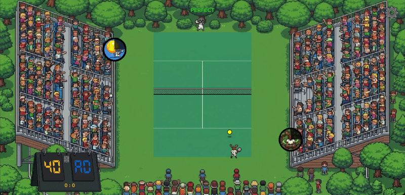

## Additional System Implementation
Beyond the technical challenges discussed previously, and the character skills and map effects mentioned in the Introduction, we implemented several supporting systems to ensure a polished and functional user experience:

-  **Interactive Tutorial:** We developed a step-by-step onboarding mode (Figure 17) that guides new players through the core controls before they start a real match.
-  **Animation:** To enhance the game's tactile feel, we created custom swing animations for every character. By synchronising these state-driven sprite sheets with the gameplay logic, we ensured that the visual impact aligns perfectly with the physics.
-  **Responsive Layout:** To support various display environments, we implemented a responsive layout using relative coordinate mapping instead of fixed pixel values (Figure 18). This ensures the game court and UI elements adapt dynamically to any window size, maintaining gameplay fairness and visibility regardless of the user's monitor resolution.
-  **Audio Management:** We enhanced the auditory experience by implementing fade-in and fade-out transitions for background music to prevent jarring shifts between scenes. Additionally, we developed a settings menu that allows for independent volume control of BGM and SFX, providing a customisable experience for the player. 
-  **Unified UI Controls & Feedback:** For improved accessibility, all menus are fully controllable via both mouse and keyboard. We focused on immediate audio-visual feedback, such as distinct hover sounds and selection highlights, to ensure the interface feels responsive and intuitive during navigation.

      <b>Figure 17:</b>
      <i>Demonstration of Interactive Onboarding</i>
       
      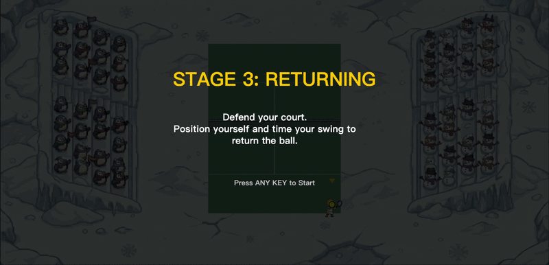

      <b>Figure 18:</b>
      <i>Demonstration of Responsive UI Design</i>
       
      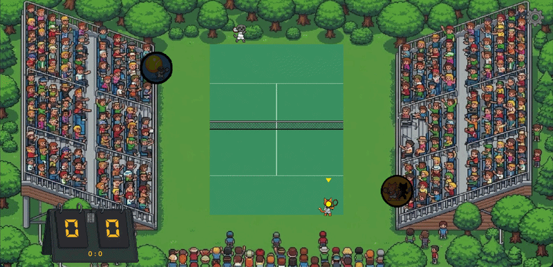

# 6. Evaluation
Understanding user feedback is a cornerstone of our development process. Our goal is to provide an experience that is both engaging and accessible. We leverage both qualitative evaluation and quantitative analysis to gain a deeper insight into user needs, allowing us to define a clear roadmap for game improvements.
## Qualitative Evaluation

### Think Aloud
During the workshop, we ran usability tests with three participants to see how they interacted with our prototype. We asked them to navigate the menu and play through two single-player sessions at different difficulty levels. By using the 'Think Aloud' method (Lewis, 1982), we were able to capture their immediate reactions and frustrations as they played. We then mapped these insights onto a Prioritisation Quadrant Diagram (Figure 19), which gave us a clear way to decide which improvements were most urgent for the next stage of development.

  <b>Figure 19:</b>
  <i>Quadrant Diagram: Think Aloud</i>
   
  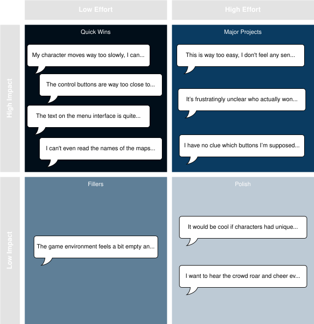

### Heuristic Evaluation
To complement the feedback we gathered from players, we also performed a Heuristic Evaluation (Table 20) based on Jakob Nielsen’s principles (1994). While 'Think Aloud' sessions showed us where players struggled, this structured audit helped us identify deeper interface flaws that might have been overlooked. By assigning severity ratings to each issue, we were able to turn our observations into a practical plan. This ensured we weren't just guessing what to fix next, but were instead tackling the most critical usability gaps first.

  <b>Table 20:</b>
  <i>Heuristic Evaluation</i>
   
  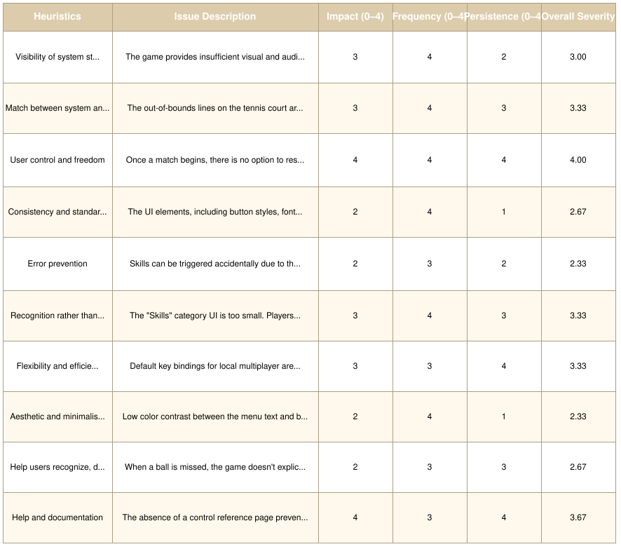

### Improvements and Implementation
Based on the feedback from our 'Think Aloud' sessions and Heuristic Evaluation, we focused on several key updates to bridge the gap between our design and the player’s needs:

- **Integrated Control Hints:** To lower the cognitive load for new players, we added a control reference guide within the pause menu. This uses clear icons to remind players of the key mappings for movement, hitting, and skills, ensuring they don't have to rely purely on memory during a match.
- **Enhanced User Control:** We implemented a functional pause menu, giving players the flexibility to restart the match or return to the main menu at any time.
- **Visual & Accessibility Optimisation:** All UI components were redesigned with larger fonts and high-contrast colours (Figure 21). This was a direct response to feedback regarding clarity and ensures the game is accessible across different screens.
- **Game Feel & Feedback:** To make the gameplay more responsive, we added visual pop-ups (like 'Miss' or 'Perfect') and integrated auditory cues, such as audience cheering, to provide immediate feedback on the player's actions.
- **AI & Match Flow:** We upgraded the AI logic with diverse serving patterns and difficulty scaling to keep the challenge engaging. Additionally, we added dedicated screens for scoring and 'side-changes' to make the match progress easier to follow.

  <b>Figure 21:</b>
  <i>Visual Improvements for the Difficulty Menu</i>

<table style="width: 100%; border-collapse: collapse; border: none;">
  <tr style="border: none;">
    <td align="center" style="vertical-align: middle; border: none; width: 45%;">
      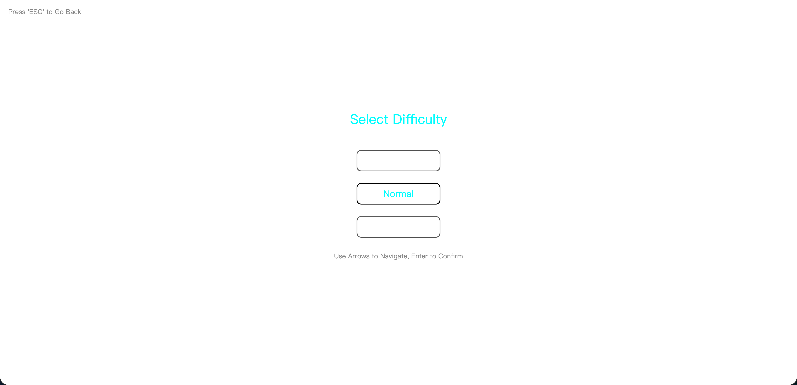
       
      <b>Figure 21a:</b> <i>Old Version</i>
    </td>
    <td align="center" style="vertical-align: middle; border: none; width: 10%;">
      ➔
    </td>
    <td align="center" style="vertical-align: middle; border: none; width: 45%;">
      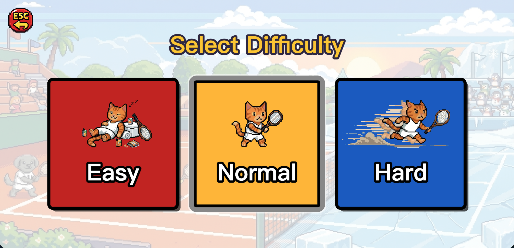
       
      <b>Figure 21b:</b> <i>New Version</i>
    </td>
  </tr>
</table>

## Quantitative Analysis
After our iterative updates, we wanted to ensure the difficulty levels were properly balanced. We recruited ten participants to test both the 'Easy' and 'Difficult' settings in our single-player mode. To get an objective measure of the user experience and mental effort required, we used the System Usability Scale (SUS) (Brooke, 1996) and the NASA Task Load Index (NASA-TLX) (Hart and Staveland, 1988). These metrics allowed us to analyse the cognitive workload across different stages, helping us fine-tune the gameplay so it feels challenging but fair.

### System Usability Scale

  <b>Table 22:</b>
  <i>System Usability Scale</i>
   
  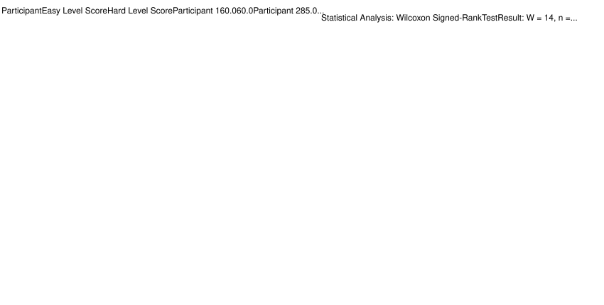

  <b>Chart 23:</b>
  <i>System Usability Scale Bar Chart</i>
   
  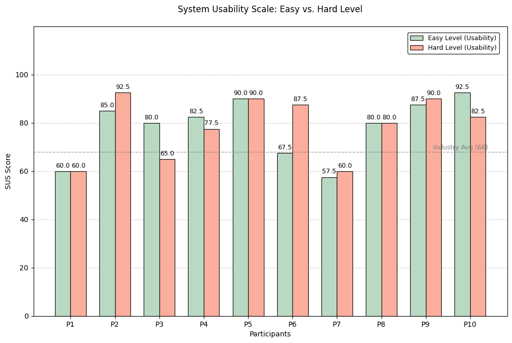

### NASA Task Load Index

  <b>Table 24:</b>
  <i>NASA Task Load Index</i>
   
  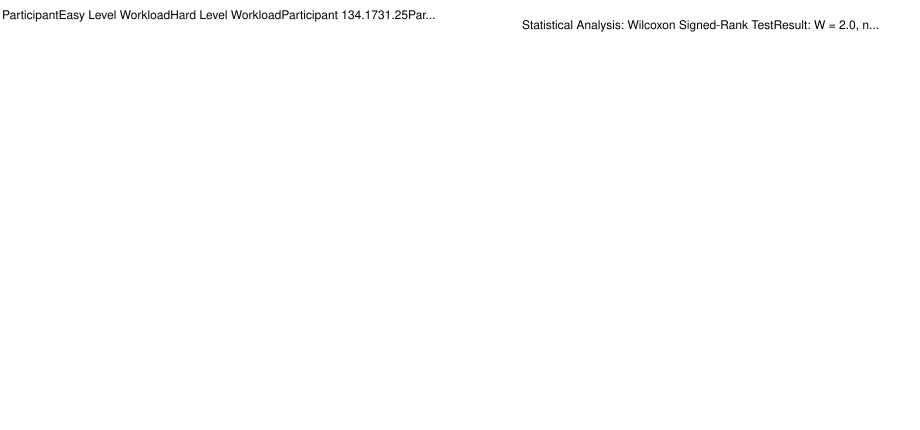

  <b>Chart 25:</b>
  <i>NASA Task Load Index Bar Chart</i>
   
  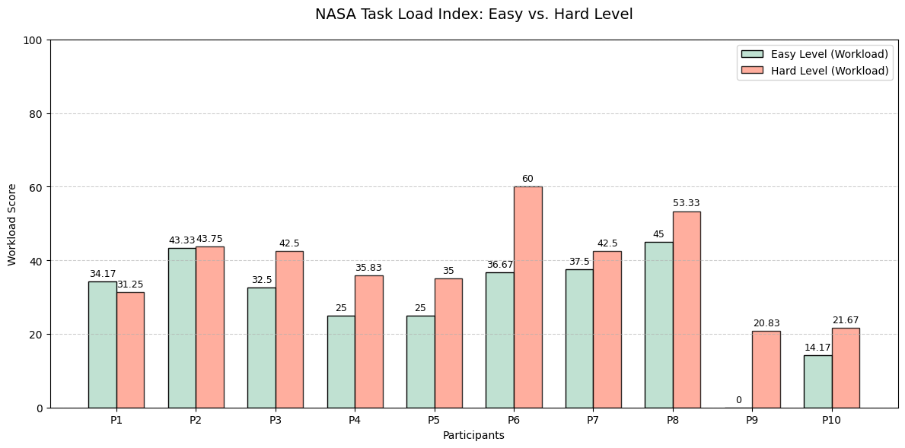

### Quantitative Findings
The quantitative evaluation demonstrates that the game successfully balances challenge with user experience:

**System Usability (SUS):** The average scores for both difficulty levels (78.25 and 78.50) are well above the industry average of 68. Statistical testing indicates no significant difference in usability between levels ($W=14 > 2$), suggesting that increasing the game's difficulty did not negatively impact the system's intuitiveness or ease of use (Table 22, Chart 23).

**Perceived Workload (NASA TLX):** There is a statistically significant increase in workload from the Easy to the Hard level ($W=2 \leq 8$). This confirms that our difficulty design was effective, as players experienced a measurably higher level of mental and physical demand, effort, and challenge in the harder mode (Table 24, Chart 25).

In summary, the results show that while the Hard level significantly increased the perceived challenge for players, the game maintained a consistently high standard of usability across both modes.

### Testing
To maintain a stable and playable experience, we established a multi-layered testing workflow throughout the development lifecycle. 

This began with a strict pre-merge process where every update required a Pull Request to be peer-reviewed, and fully tested. The specifics of this collaborative review process are detailed in the Process section. 

To further accelerate our cycle, we built a custom debug interface (Figure 26) for manual black-box testing. It allowed for the instant toggling of difficulty, characters, and maps, making it much easier to isolate edge cases without playing through entire matches. 

Finally, we integrated automated white-box testing with Jest to verify our scoring and collision logic. By decoupling these mathematical calculations from the p5.js rendering engine, we were able to ensure the game’s core rules remained accurate and functional, completely independent of the visuals.

  <b>Figure 26:</b>
  <i>Demonstration of Debug Mode</i>
   
  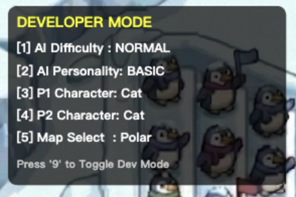

# 7. Process 
Our team dynamic focused on clear roles and consistent communication. While we worked as a flat organisation, we divided responsibilities based on our individual strengths, such as core physics, AI logic, and UI design. To keep the project on track, we broke down our goals into specific weekly deliverables, ensuring everyone knew exactly what they were responsible for each week.

We combined weekly in-person meetings (Figure 27) with daily digital communication to stay organised. Our weekly sessions were reserved for deep-dive technical discussions and long-term planning, while **WhatsApp** (Figure 28) served as our hub for rapid decision-making and continuous updates. We also utilised **GitHub Issues** and **Pull Requests** to host more detailed technical conversations (Figure 29). Posting test results and logs directly on the platform allowed us to discuss changes in context and keep a clear record of why specific implementation choices were made. This multi-layered approach ensured that major blockers were resolved together while daily progress never stalled.

  <b>Figure 27:</b>
  <i>Weekly Team Meeting</i>
   
  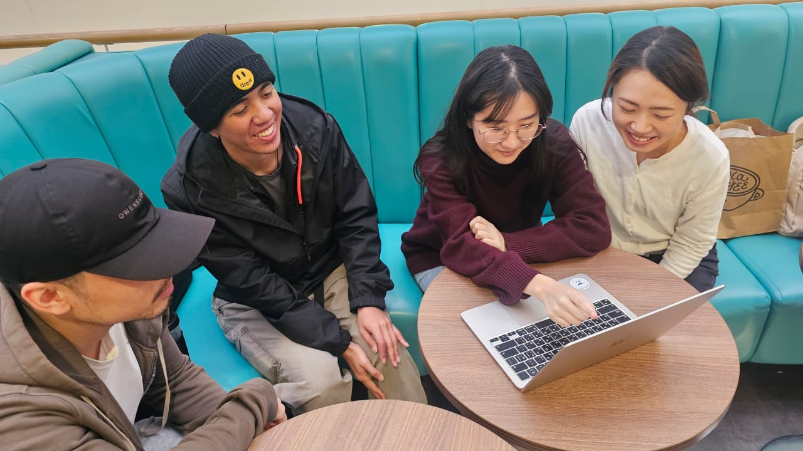

  <b>Figure 28:</b>
  <i>WhatsApp Communication</i>
   
  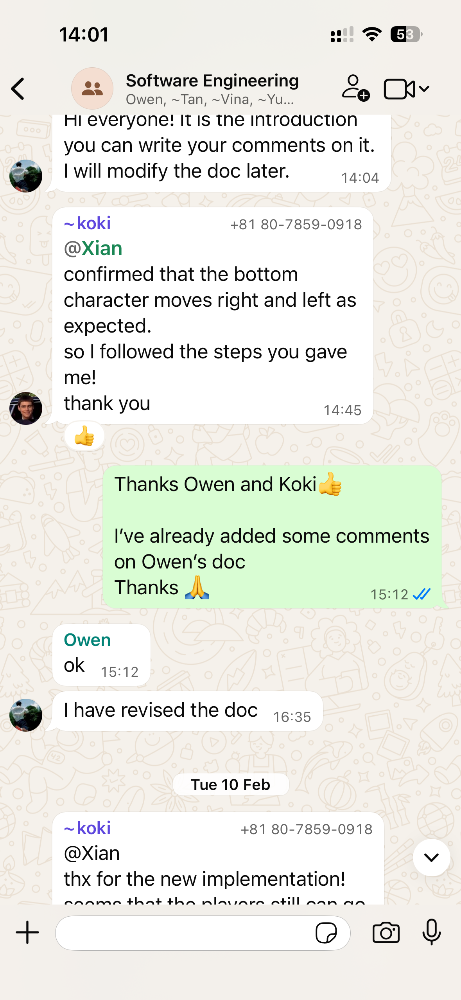

  <b>Figure 29:</b>
  <i>Peer review and technical discussion within a Pull Request</i>
   
  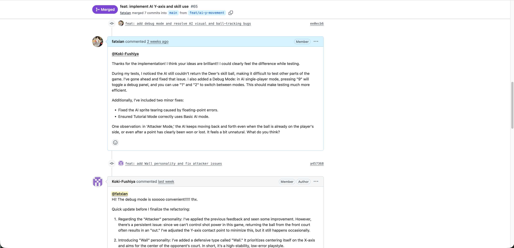

To keep our development on track, we used [**GitHub Projects**](https://github.com/orgs/UoB-COMSM0166/projects/165) (Figure 30) as our centralised Kanban board. We created specific issues for every feature, bug fix, and documentation task, tracking them through a clear pipeline from `Ready` to `Done`. This visual workflow was crucial for managing our weekly progress and ensuring no critical tasks fell through the cracks. For writing and report drafting, we relied on **Google Docs** (Figure 31) as our primary space for real-time collaborative editing.

  <b>Figure 30:</b>
  <i>GitHub Projects</i>
   
  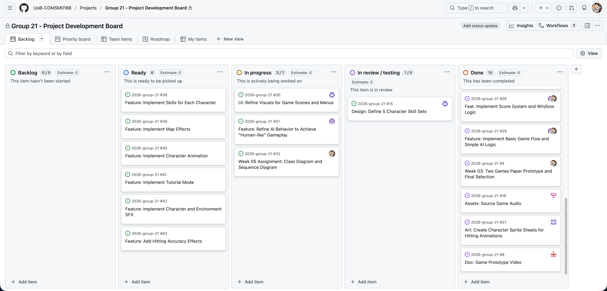

  <b>Figure 31:</b>
  <i>Google Docs</i>
   
  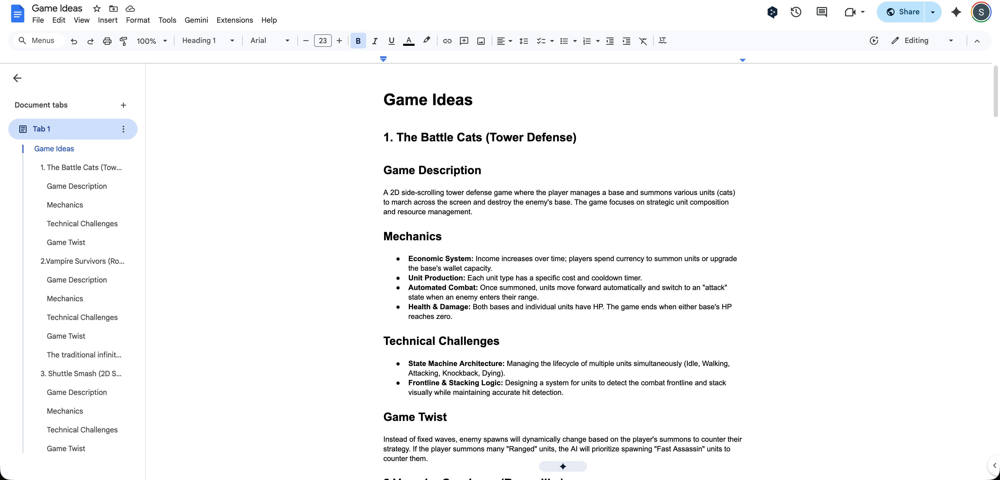

### **Workflow and Standardisation**
Managing a shared codebase with six contributors required clear standards to avoid integration issues. We established a technical workflow within a [**`CONTRIBUTING.md`**](docs/CONTRIBUTING.md) file, which served as our primary guide for the team. This document outlined our core standards, such as using CamelCase for consistent naming and ensuring commit messages were descriptive enough to keep our version history readable. 

We strictly followed a 'Feature Branching' strategy (Figure 32), where development was restricted to dedicated branches. To protect our `main` branch, the cornerstone of our workflow was the mandatory Pull Request (PR) and Peer Review process (Figure 33). No code was merged until it had been reviewed and tested by another teammate, a practice that not only caught bugs early but also ensured that technical knowledge was shared across the entire group.

  <b>Figure 32:</b>
  <i>Branch</i>
   
  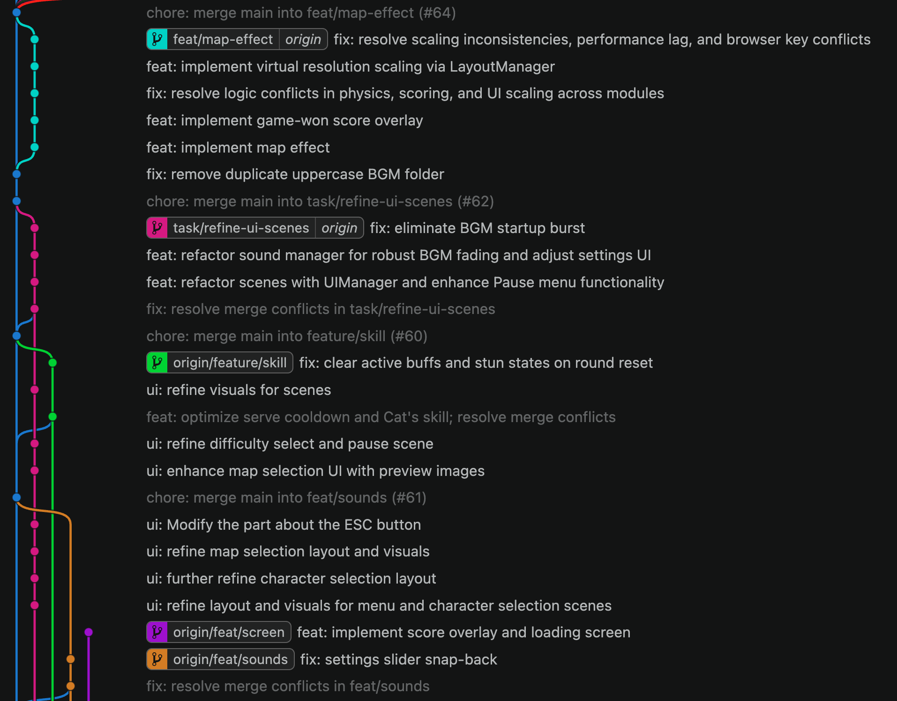

  <b>Figure 33:</b>
  <i>GitHub Pull Request</i>
   
  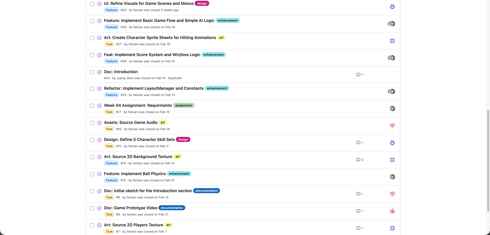

### **Reflection**
Implementing our workflow in practice wasn't always smooth, and our ability to adapt was key to our success. In the beginning, the team struggled with Git collaboration; while merge conflicts were expected, we initially lacked the confidence to resolve them effectively. This uncertainty often slowed us down and resulted in messy commit histories. We fixed this by centralising our procedures in a `CONTRIBUTING.md` file. This guide acted as a roadmap for the team, providing clear instructions for Git operations. Once these guidelines were in place, members could resolve technical friction on their own, allowing us to move much faster and maintain a higher standard for our shared code.

A major challenge we faced was the varying levels of familiarity with p5.js among team members, which naturally affected our individual coding speeds. Initially, this led to an uneven workload in core development. While we tried to balance weekly tasks, the reality was that members with more technical experience often contributed a larger volume of code. We managed this gap by assigning each person clear, distinct deliverables that matched their strengths. This strategy ensured that everyone remained productive and motivated, keeping our progress consistent throughout the project.

Balancing development with academic breaks like Reading Week and Easter proved to be a challenge. To ensure everyone could fully recharge, we paused our meeting schedule during these holidays. While this was important for morale, it did cause our momentum to stall. We found that getting everyone back on the same page and merging individual updates post-holiday required a significant 'catch-up' period. Moving forward, we realised that setting clearer milestones before major breaks would have made the re-integration process much smoother.

## **Production Tools**
Due to the lack of a specialised artist in our group, we leveraged Generative AI tools to create our game assets, which was essential to achieving our desired aesthetic within the limited time. We utilised **Gemini** and **Banana Pro** for generating core visual assets. Following a process of manual refinement, we used [**EZGIF**](https://ezgif.com/) to convert video animations into individual image frames, which were then imported into [**PISKEL**](https://www.piskelapp.com/) to be compiled into functional Sprite Sheets. Background music was produced using [**Suno**](https://suno.com/), while sound effects were created via [**Adobe Firefly**](https://firefly.adobe.com/). For system architecture documentation, we utilised [**drawio**](https://www.drawio.com/) and [**mermaid**](https://mermaid.live/).

# 8. Sustainability, ethics and accessibility
This section explores the broader implications of our project, detailing how technical decisions align with environmental responsibility, inclusive design, and ethical social impact.

  <b>Figure 34:</b>
  <i>Sustainability Pentagon</i>
   
  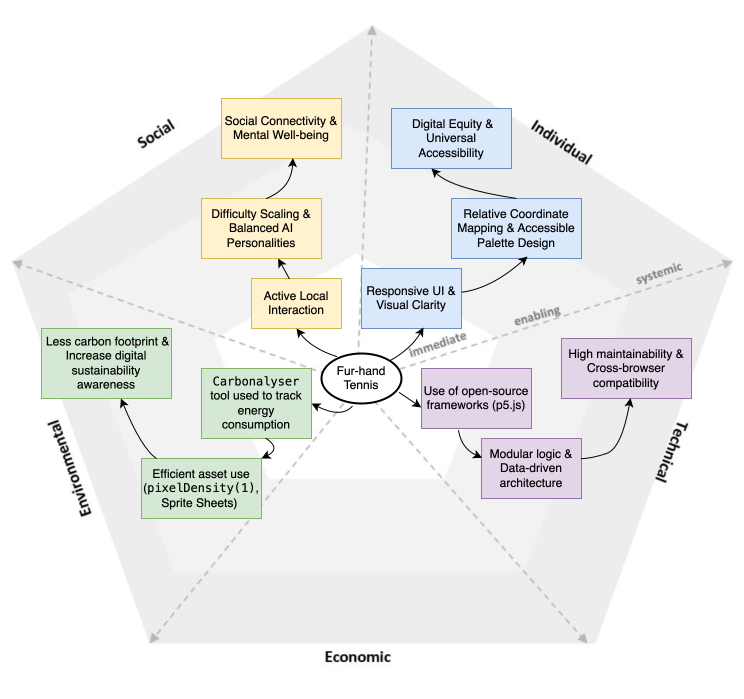

## Environmental Sustainability
Our implementation prioritises [Green Software Engineering](https://patterns.greensoftware.foundation/) by minimising the energy required to execute and transmit the game.

#### Optimising GPU Workload
We specifically set `pixelDensity(1)` to manage how the game renders on high-resolution (High-DPI) displays. By avoiding the browser's default tendency to oversample pixels, we eliminated redundant processing load on the GPU. This maintains crisp visuals for our pixelated aesthetic without wasting energy. It effectively reduces thermal output and extends battery life on portable devices.

#### Lean Asset Management
Compared to video formats (GIF/MP4) that require continuous decoding, we used Sprite Sheets to handle animations. This significantly reduces the processing load on the CPU and GPU. Additionally, using a single consolidated image file minimises HTTP requests compared to loading individual animation frames. Furthermore, every asset was manually scaled to its minimum required resolution, ensuring no redundant pixels are transmitted.

#### Carbon Audit
Using the [Carbonalyser tool](https://addons.mozilla.org/fr/firefox/addon/carbonalyser/), we audited a 3-minute active gameplay session, which recorded a data payload of 48MB (Figure 35). This confirms that once assets are cached, the game operates with minimal bandwidth. The resulting carbon intensity was exceptionally low, comparable to a single smartphone charge, validating our lightweight architectural choices.

  <b>Figure 35:</b>
  <i>Comparative Carbon Audit: Initial Load (Left) vs. 3-Minute Gameplay (Right)</i>

<table align="center" style="border-collapse: collapse; border: none;">
  <tr style="border: none;">
    <td align="center" style="border: none; padding: 10px;">
      
       
      <small>Initial Load</small>
    </td>
    <td align="center" style="border: none; padding: 10px;">
      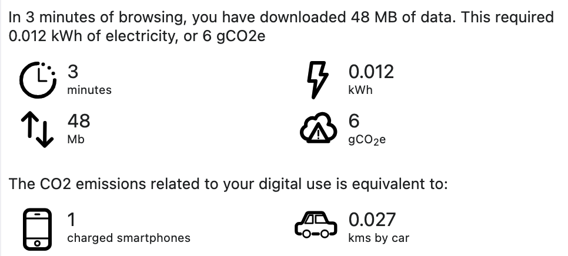
       
      <small>3-Minute Gameplay</small>
    </td>
  </tr>
</table>

## Ethics and Individual Impact
We prioritise the personal development and fundamental rights of the individual. By focusing on internal well-being and data minimisation, we ensure a secure and supportive user experience.

#### Mental Well-being
Research by Russoniello et al. (2009) suggests that simulated, non-violent video games provide positive psychological cues. By providing immediate 'Perfect' visual feedback for precise hits and encouraging prompts upon completing tutorial stages, our game reinforces a sense of mastery. This consistent positive reinforcement transforms responsive mechanics into an effective tool for reducing daily anxiety.

#### Lifelong Learning
By incorporating fundamental rules and scoring systems (e.g., 'Love', 15, 30), players incidentally acquire sporting literacy through active play. This simplified simulation lowers the barrier to entry for real-world tennis, potentially sparking a long-term curiosity and encouraging players to explore physical skills beyond the digital screen.

#### Privacy and Content Safety
We prioritise player privacy through Data Minimisation. Our game is designed to operate entirely without collecting, tracking, or storing any personal data, ensuring a transparent and safe environment for all users. This commitment to safety is further reinforced by adhering to PEGI 3 standards, ensuring a non-violent, healthy digital environment for all age groups.

## Accessibility and Social Impact
We focus on fostering social equity and inclusive participation. By removing physical and technological barriers, the game creates a shared space for diverse user groups to connect.

#### Hardware Inclusivity and Digital Equity
Through Relative Coordinate Mapping, the game maintains a consistent layout across all resolutions, from legacy 4:3 monitors to modern high-definition displays. This promotes Digital Equity by ensuring the full experience is accessible to users regardless of their hardware's age or cost.

#### Adaptive Interface Accessibility
To accommodate diverse motor skills and hardware setups, all game menus and catalogues feature a dual-input system. Supporting both mouse and keyboard navigation allows players to choose the interaction method that best suits their physical comfort or available technology. This hybrid approach ensures an intuitive and inclusive browsing experience for all users from the very first interaction.

#### Visual and Interface Clarity
The UI utilises high-contrast colour palettes and oversized typography to accommodate players with visual impairments or age-related sight decline. This ensures that critical game states, such as score and skill cooldowns, are instantly recognisable.

#### Social Connectivity
The game is designed to encourage local social bonding. During our User Testing sessions (as seen in Figure 36), we observed participants engaging in high-spirited interaction and laughter while playing together. This qualitative evidence supports our goal of creating a 'safe social space' that fosters real-world connectivity.

  <b>Figure 36:</b>
  <i>User Testing Footage (Explicit informed consent obtained)</i>
   
  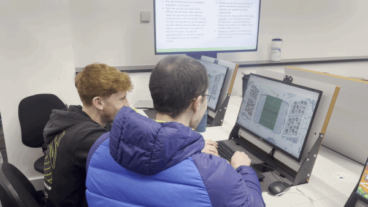

# 9. Conclusion
This project was a great practical exercise in managing the intersection of software engineering and game design. We learned firsthand that a working game requires much more than just clean code, it requires constant communication and alignment. By engaging in the early workshop exercises, we were able to set clear objectives for our game from the very beginning. This preparation was key in helping us integrate our separate contributions into a stable system, even as the game logic grew more complex over the term.

### Challenges and Reflection  
During the early stages of the project, we encountered minor Git merge conflicts due to overlapping edits in core modules. To keep our workflow smooth, we sequenced our tasks so that foundational logic was finalised before we moved on to dependent features.

Reflecting on this experience, we realised that these overlaps were a result of our code structure having too much interdependency between game logic and rendering. While managing our task sequencing served as a helpful workflow adjustment, a more robust technical solution for future projects would be to implement design patterns such as Entity-Component-System (ECS) or Model-View-Controller (MVC) separation. Separating logic from graphics allows for parallel development without overlapping. This approach ensures a smoother process and significantly reduces potential errors.

Another significant learning point involves our testing strategy. While we successfully integrated the Jest framework to verify core mechanics like the `ScoreManager` and `Ball` physics, this was implemented during the final stages of development. Looking back, we realised that starting with a Test-Driven Development (TDD) approach would have made the code much more reliable and saved us a lot of time by catching bugs much earlier in the process.

### Future Work  
One of the things we struggled with was adding a fourth AI type called the 'Attacker'. We really wanted to make a personality that would play aggressively and put pressure on the player. However, we realised that since our current physics model uses a constant speed for the ball, we couldn't actually control how hard the ball was hit. This made it almost impossible to balance the Attacker's playstyle. In the end, we decided not to include it in the main game, but you can still try it out by pressing '9' in the Debug Panel.

That’s why our next big goal is to replace the fixed-power system with a more dynamic 'Hit Force' mechanic. We want hit power to be determined by charge duration, requiring players to time their button press and hold it to unleash a stronger shot. This would add a lot more depth to the game’s strategy. Fixing this core physics part is the first step we need to take before we can finally get the Attacker AI working the way we originally imagined.

If we were to take this project even further, our focus would be on adding a lot more variety and bringing the game online. We’d love to introduce a diverse roster of characters, each with their own unique stats, along with themed maps where surface friction, like grass or clay, actually changes how the ball behaves. The biggest goal, however, would be moving beyond local play. By implementing a client-server architecture with WebSockets, we could open the game up to global competition and real-time matchmaking.

# 10. AI statement
Generative AI tools were utilised for technical and creative support during this project. Specifically, AI was used to generate base assets for character sprites, court backgrounds, and audio samples. These assets underwent further refinement by the team to ensure their seamless integration into our game project. Beyond assets, AI served as a technical consultant. For instance, it facilitated our initial learning of p5.js and assisted in troubleshooting specific logic errors, which accelerated our development process. Overall, every AI-generated component was manually reviewed and refined by the team.

# 11. Contribution Statement

  <b>Table 37:</b>
  <i>Contributions for Game Project</i>

| Contributor           | Contribution  | 
| --------------------- | ------------- |
| Xian Li               | 1.00          |
| Yu-Han Sun            | 1.00          |
| Yu-Chun Chen          | 1.00          |
| Yujing Shen           | 1.00          |
| Panarin Thipboonthong | 1.00          |
| Koki Fushiya          | 1.00          |

# 12. References
Agile Business Consortium. (2014). The DSDM Agile Project Framework. Available at: https://www.agilebusiness.org (Accessed 24 April 2026).

Alexander, I. F. (2005). A taxonomy of stakeholders: Human roles in system development. International Journal of Technology and Human Interaction, 1(1), 23–59.

Brooke, J. (1996). SUS: A quick and dirty usability scale. In P. W. Jordan, B. Thomas, I. L. McClelland, & B. Weerdmeester (Eds.), Usability evaluation in industry (pp. 189–194). Taylor & Francis.

Cohn, M. (2005). Agile estimating and planning. Prentice Hall PTR.

Hart, S.G., & Staveland, L.E. (1988). Development of NASA-TLX (Task Load Index): Results of empirical and theoretical research. In P. A. Hancock & N. Meshkati (Eds.), Human mental workload (pp. 139–183). North-Holland.

Lewis, C.H. (1982). Using the thinking-aloud method in cognitive interface design. IBM Research Center.

Nielsen, J. (1994). Usability engineering. AP Professional.

Russoniello, C.V., O'Brien, K. & Parks, J.M. (2009). The effectiveness of casual video games in improving mood and decreasing stress. Journal of CyberTherapy & Rehabilitation, 2(1), 53–66.