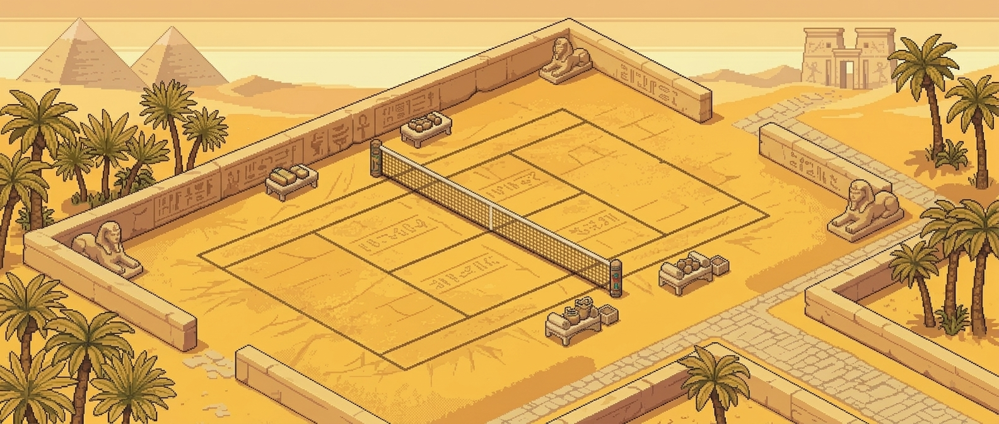
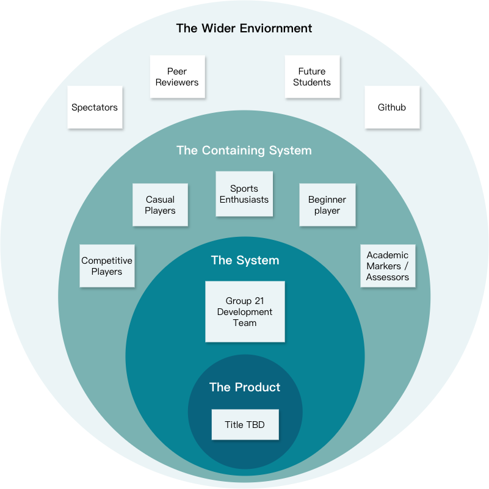
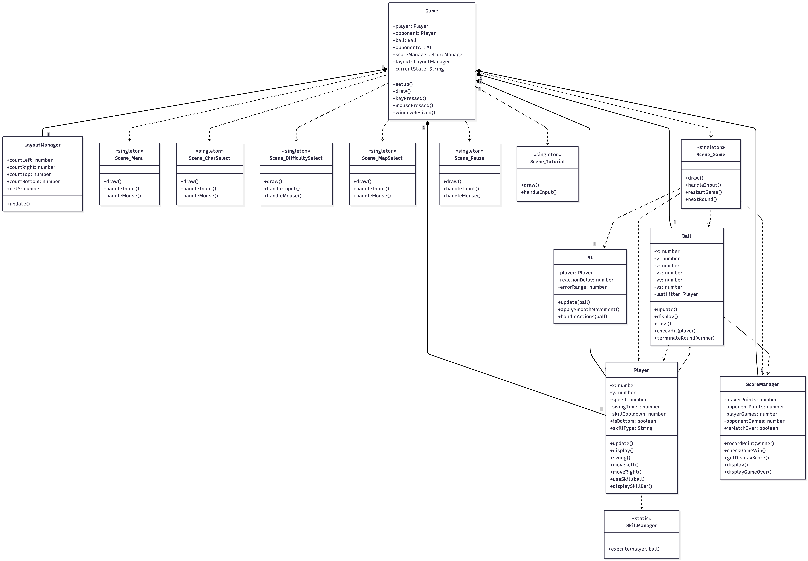
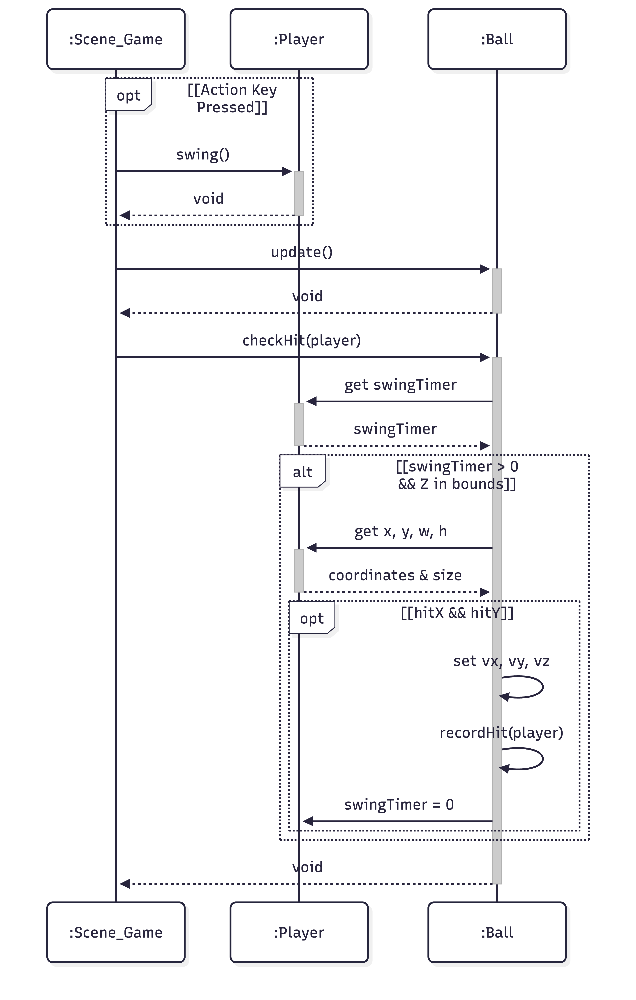
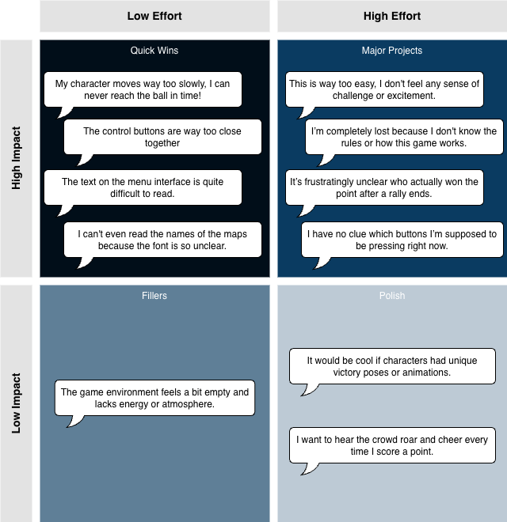
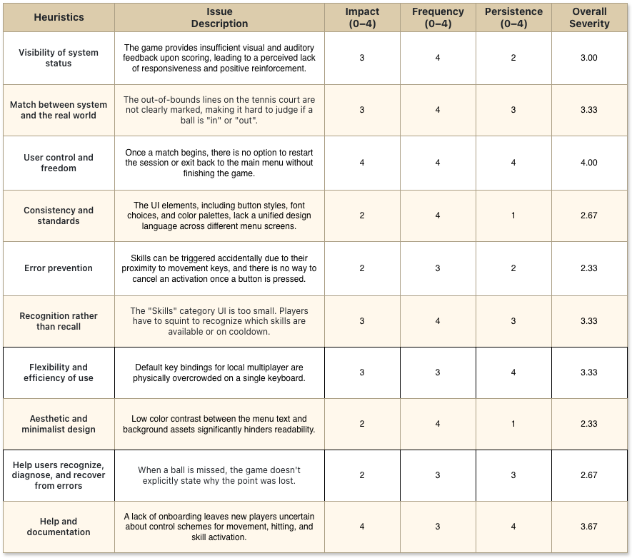
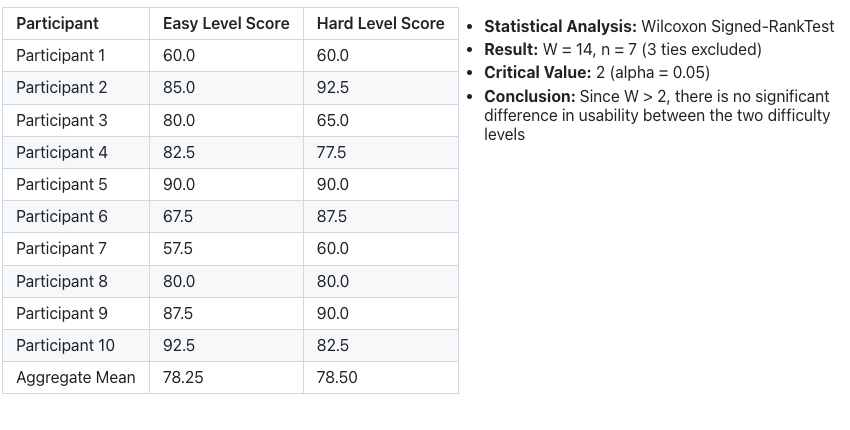
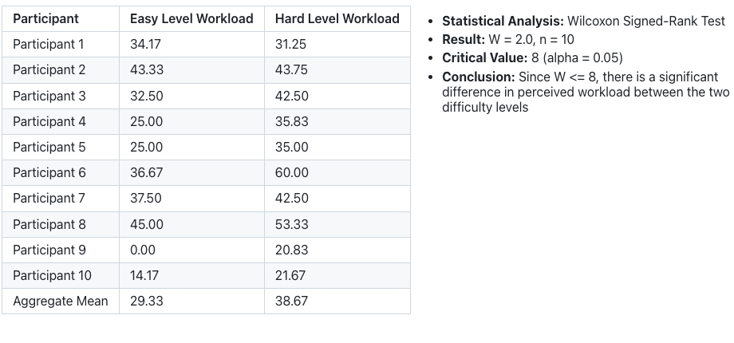

Banner placeholder

[CLICK HERE TO PLAY GAME ](https://uob-comsm0166.github.io/2026-group-21/)

# Video Demonstration

# Table of Contents
1. [Development Team](https://github.com/UoB-COMSM0166/2026-group-21?tab=readme-ov-file#1-development-team)
2. Introduction
3. Requirements
4. Design
5. Implementation
6. Evaluation
7. Process
8. Sustainability, ethics and accessibility
9. Conclusion
10. AI statement
11. Contribution Statement

# Development Team

  

| NAME                  | EMAIl                 | ROLE |
| --------------------- | --------------------- | ---- |
| Xian Li               | yd25988@bristol.ac.uk |Lead Developer|
| Yu-Han Sun            | qv25088@bristol.ac.uk |Multimedia Developer|
| Yu-Chun Chen          | df25142@bristol.ac.uk |UI/UX Developer|
| Yujing Shen           | pf25516@bristol.ac.uk |Interaction Developer|
| Panarin Thipboonthong | uk25559@bristol.ac.uk |Gameplay Developer|
| Koki Fushiya          | bz25385@bristol.ac.uk |AI & Testing Developer|

# Introduction
**(Working Title TBD)** is a top-down 2.5D 1v1 tennis game inspired by genre classics like *Super Tennis* and *Mario Tennis*. As a team of tennis enthusiasts, we wanted to capture the sport's intensity into a fast-paced digital experience.

We have streamlined the traditional rules to keep the action fluid: players use simple movement controls alongside dedicated Serve and Skill buttons to outmaneuver their opponent. You score points by forcing a miss or driving the ball out of your opponent's reach, with the first player to hit the target game count declared the winner.

At the core of the game is a custom ball physics system built to balance realistic collisions with arcade-style gameplay. This engine powers both local multiplayer and single-player modes against a custom AI. To ensure no two matches feel the same, we've introduced two key twists:

- **Skill System:** To add a layer of strategy to the 1v1 matches, we implemented a character-based ability system. Each player can trigger a unique active skill that grants a tactical advantage, ranging from instant movement to ball manipulation, as summarized in the table below:

  <b>Table 1:</b>
  <i>Character Skill Sets Overview</i>

|Character|Image|Skill|Description|
|:-|:-|:-|:-|
|**cat**||Shadow Teleport|Instantly teleports the character directly in front of the ball.|
|**Dog**||Giga Ball|Hits a massive ball that increases the hit area and stuns the opponent upon contact.|
|**Deer**||Forest Zen|Launches a slow-speed ball to disrupt the opponent's timing.|
|**Bird**||Feather Storm|Shrinks the ball while significantly increasing its velocity.|

  <b>Figure 2:</b>
  <i>Demonstration of Dog's "Giga Ball" skill</i>
   
  

- **Dynamic Environments:** To keep matches unpredictable, we developed diverse stages with unique environmental hazards. Beyond character skills, the court itself acts as a variable, forcing players to adapt their movement and timing based on specific environmental mechanics, as summarized in the table below:

  <b>Table 3:</b>
  <i>Maps Overview</i>

|Map|Image|Map Effect|
|:-|:-|:-|
|**Polar**||Features a frozen court that significantly reduces friction.|
|**Eygpt**||Triggers sandstorms at random intervals with varying wind directions. These gusts apply a force to the ball.|
|**Wimbledon**||A classic grass court with no environmental hazards.|

  <b>Figure 4:</b>
  <i>Demonstration of wind affecting ball trajectory</i>
   
  

    

# Requirements 
## Ideation Process
During our initial brainstorming session, our team generated a wide range of creative concepts. However, due to our limited familiarity with p5.js, there were concerns regarding the technical feasibility of these ideas. To address this, we conducted independent research before the subsequent meeting. Each member proposed one or two game concepts in a shared [Google Doc](https://docs.google.com/document/d/1nrocSGf6uqzb97ttsJxpVtYdhJrd-7BKs9r7RD0a1_Y/edit?usp=sharing), ensuring that each proposal included two challenges and a "twist" for gameplay depth.

Interestingly, three members proposed similar ball-sports games. After an in-person discussion and a voting process, the Tennis Game and a Vampire Survivors-style game emerged as the top two candidates.
## Early Stages Design
We conducted market research through Google and the Steam store to analyze existing games within similar genres, using them as references for visual aesthetics and gameplay mechanics. This research informed our development during the Week 3 workshop and a subsequent offline session, where we developed paper prototypes for both candidate games.

During the workshop, we engaged with other teams for feedback and discovered that the tennis game received a significantly more positive response. Furthermore, our team members shared a collective passion for sports games, and we found our creative ideas for the tennis project to be more comprehensive during the prototyping phase. Based on these three factors, namely user feedback, team interest, and conceptual depth, we officially selected the tennis game as our project.

The paper prototyping process also prompted deeper discussions regarding game mechanics and user flow, such as the requirement for character and map selection. Moreover, it helped us identify potential conflicts, such as differing opinions on the degree of adherence to real-world tennis rules. To resolve these ambiguities, we subsequently employed User Stories and Use Case modeling to formally define and establish our system requirements.

  <b>Figure 5:</b>
  <i>Tennis Game Paper Prototype </i> 
  <a href="https://www.youtube.com/watch?v=qdplPSo7CMk" target="_blank">Watch it on YT for full audio-visual feedback</a> 
  

  <b>Figure 6:</b>
  <i>Vampire Survival Paper Prototype </i> 
  <a href="https://www.youtube.com/watch?v=HRUYlSV_QAU" target="_blank">Watch it on YT for full audio-visual feedback</a> 
  

## Stakeholders
During the current development lifecycle, the Development Team acts as the primary operator, while Gamers represent the intended beneficiaries whose needs guide our requirements. Moreover, Markers/Assessors act as functional operators during the evaluation phase, interacting with the system to verify that all software requirements are met. Specifically, Markers fulfill a Surrogate Role, representing the high-standard expectations of a polished product. Consequently, we have categorized both Gamers and Markers within the Containing System, as their roles are essential to the operational success and validation of the project.

  <b>Figure 7:</b>
  <i>Onion Model for Stakeholders </i> 
  
  </img>

## User Stories
We initially generated a wide range of [User Story ideas](https://docs.google.com/document/d/1LYooThDOOa3G9zB3lg5oMovLOXHKsaj8kRKYu5YS_vA/edit?usp=sharing) to define our game's features. To manage our project scope effectively, we employed the MoSCoW method to prioritise these requirements and conducted Planning Poker sessions to estimate the development effort for each task. This structured approach enabled us to make critical trade-offs within our limited timeframe. 

By focusing on high-value requirements, we finalised the following set of User Stories for implementation:

  <b>Table 8:</b>
  <i>User Stories </i>

| Epics | User Stories | Acceptance Criteria (AC) |
| :--- | :---- | :--- |
| Core Gameplay System | As a competitive player, I want the game to support dual-input mode on a single computer so that I can engage in real-time 1v1 matches with my friends. | Given two players are on the same computer, when they press their respective movement keys simultaneously, then both characters must move independently without input interference. |
|  |As a casual player, I want to play against an AI opponent so that I can practice and enjoy the game even when a teammate is unavailable. | Given the player is at the main menu, when they select the "Single Player vs. AI" option, then the game should initialize a match with a computer-controlled opponent.|
|  | As a casual player, I want to trigger unique skills via specific keys so that the match becomes more dynamic and engaging. | Given a skill has just been used, when the player attempts to trigger it again immediately, then the system should prevent the action until the cooldown period has ended. |
|  | As a sports enthusiast, I want the ball to exhibit realistic collision, so that the trajectory feels authentic. |Given the ball strikes a surface, when it bounces, then its velocity and reflection angle must reflect realistic energy loss.|
| Score System | As a competitive player, I want the screen to display real-time scores and the current set so that I can track match progress and determine the winner. | Given a match is in progress, when a player scores a point, then the UI must immediately update the corresponding score display area.|
|  | As a sports enthusiast, I want the game to follow traditional tennis scoring logic so that I can experience the authentic rhythm of a tennis match. | Given a player has 30 points, when they win the next rally, then their score must advance to 40 instead of 31.|
| User Onboarding System | As a beginner player, I want to see control icons on the start screen so that I can quickly understand how to move, swing, and use skills. | Given the player is on the start screen, when they view the instructions, then they should see clear icons mapping keys to movement, serving, and skills for both players.|
| | As a beginner player, I want an interactive tutorial level to guide me through movement, hitting, and skill usage so that I can become familiar with the controls before a real match. |Given the player is in the tutorial mode, when they successfully return three balls, then the system must display a "Tutorial Complete" prompt and allow them to exit.|

## Use-Case Diagram
Following the analysis of our User Stories, we developed a Use Case Diagram to translate these requirements into specific system behaviors. This process allowed us to define the functional boundaries of the game more precisely. For instance, we established an << include >> relationship between the "Hit Ball" and "Calculate Ball Physics" use cases. This structural decision clarified a critical technical dependency before implementation: physics calculations are not an optional feature but an indispensable component of the core gameplay loop. 

      <b>Figure 7:</b>
      <i>User Diagram </i>
       
      
      </img>
    

## Refletion
We recognized early on that Use Case Diagrams and User Stories are not static documents but evolving tools that helped define our core architecture and unified our team vision. However, as we transitioned into the implementation phase, our deepening technical understanding of the game system led us to constantly update these requirements to ensure they served as a robust baseline for testing.

This internal evolution took a significant turn during the workshop. The real eye-opener came when we were observing other teams' demos; we quickly realized how frustrating it was to have no idea how the mechanics worked or what the buttons did just by watching. This firsthand frustration made us look back at our own design with fresh eyes, realizing we had fallen into the 'Expert Bias' trap: because we built the game, the controls felt intuitive to us, but they would likely be a mystery to a new player. This realization convinced us to prioritize the User Onboarding System, showing us that no matter how fun the core gameplay is, it is wasted if the player gets 'stuck at the front door'.

Ultimately, prioritizing these essential user needs led to the hardest decision of the project: scrapping the online multiplayer mode. While we were excited about the idea, Planning Poker gave us a cold, hard look at the numbers, revealing that forcing a complex network feature into our limited timeframe would likely result in a buggy mess. By choosing to "let go" of that ambition, we were able to protect the quality of our Must-haves, such as the local 1v1 experience and the physics engine, a strategic trade-off that allowed us to focus on what truly mattered for the final product.
# Design
## System Architecture
Our game is architected using a Scene-Based Finite State Machine (FSM) pattern implemented within the p5.js framework.

*   **Game Loop & State Management:** The entry point, `sketch.js`, maintains a global `currentState` variable. The main `draw()` loop manages the control flow by delegating rendering and logic updates to specific Scene objects (e.g., `Scene_Menu`, `Scene_Game`) based on the current state. This design ensures that logic for the menu, character selection, and gameplay remains decoupled。
*   **Entity Coordination:** Game entities like `Player` and `Ball` encapsulate their own rendering and logic. The `Scene_Game` coordinates these entities and bridges them with global managers such as the `ScoreManager`, ensuring smooth interaction during gameplay。
*   **Manager Pattern:** We utilize specialized manager classes (`ScoreManager`, `LayoutManager`) to handle global responsibilities such as game rules, scoring, and responsive screen layout calculations, keeping the core entity classes focused on their specific behaviors.

## Class Diagrams
Our system design underwent several iterations to balance functional requirements with code maintainability. Initially, as shown in Figure 8, our class diagram focused on establishing a clear inheritance hierarchy for game entities. We defined an abstract `Player` class to encapsulate shared movement and swinging logic, while delegating character-specific abilities to the `Cat` and `Dog` subclasses.

  <b>Figure 8:</b>
  <i>Early Class Diagram</i> 
  </img>

However, as we began adding more features and the game mechanics grew in complexity, we transitioned to a more modular architecture to avoid code duplication and improve maintainability. The final system, as illustrated in figure 9, shifts toward Composition and Separation of Concerns:

*   **`Player` & `Ball`:** These core classes encapsulate their own physical states and interactions. We made a strategic decision to consolidate the original `Cat` and `Dog` character subclasses back into the `Player` class, using internal state variables like `characterType` to differentiate them. This data-driven approach prevents "Class Explosion" and allows for adding new characters via configuration rather than new source files.
*   **`AI` (Controller):** Instead of subclassing `Player`, the `AI` class uses Composition. It holds a reference to a `Player` instance (has-a relationship) and manipulates its inputs. This allows the same `Player` class to be controlled by either a human or an algorithm without code duplication.
*   **`SkillManager`:** Implemented as a static utility, this class encapsulates the logic for different special abilities. The `Player` class delegates skill execution to this manager, allowing for easy expansion of new skills (e.g., `SHADOW_TELEPORT`, `GIGA_BALL`) without modifying the player class.
*   **`Scene_Game`:** Acts as the composite root for the gameplay session, aggregating `Player`, `Ball`, and `ScoreManager`.

By employing Composition for core entities and Dependency for behavioral interactions, the system ensures that physics logic, scoring rules, and scene transitions remain independent and easily maintainable.

  <b>Figure 9:</b>
  <i>Final Class Diagram</i> 
  </img>

## Behavioural Diagrams
To illustrate the game's logic flow, we analyzed the "Ball Hit Detection" scenario, which is critical for the gameplay feel.
- **Input & Physics Update:** `Scene_Game` processes player inputs via `swing()` and independently advances the ball's physics using `update()`.
- **State Validation:** Triggered by `checkHit()`, the system first verifies the player's swingTimer and the 3D hit window (Z-axis). If the player is idle, the check safely aborts to optimize performance.
- **Spatial Check:** Once validated, the ball retrieves the player's 2D coordinates and size to confirm bounding box intersection (`hitX` and `hitY`).
- **Physics Resolution:** Upon a confirmed collision, the ball calculates new velocity vectors (`vx`, `vy`, `vz`), updates the match state via `recordHit()`, and resets the player's `swingTimer` to complete the interaction.

  <b>Figure 10:</b>
  <i>Sequence Diagram: Ball Hit Logic</i>
   
  </img>

Employing object-oriented design and UML diagrams was essential for organizing our ideas and establishing a shared understanding of the game's architecture. However, manually updating detailed UML is time-consuming. To keep our documentation agile, our workflow evolved from hand-drawn sketches to Draw.io, and ultimately to Mermaid. Adopting this text-based tool significantly accelerated the process, allowing our diagrams to evolve as "living tools" alongside the codebase. These finalized models now serve as vital documentation for future system maintenance.

# Implementation
## **Technical Challenge 1: Pseudo-3D Ball Physics and Responsive Hitting**

The first major challenge was making a 2D game feel like a 3D tennis match. If we only moved the ball on the X and Y axes, the game would feel very flat. We needed to simulate height and make the hitting mechanics feel natural when the ball interacts with the court surface.

### **1. Simulating Ball Height and Trajectory**
To create a 3D effect on a 2D canvas, we introduced a $z$ variable to represent the ball's height. Instead of just moving the ball, we calculate its vertical position using gravity ($g$) in every frame:

$$z_{t+\Delta t} = z_t + v_{z,t} \cdot \Delta t$$

$$v_{z,t+\Delta t} = v_{z,t} - g \cdot \Delta t$$

To render this properly on a 2D screen, we mapped our internal 3D coordinates to 2D screen coordinates $(x', y')$ using a height-offset projection:

$$\begin{cases} x' = x \\ y' = y - z \end{cases}$$

This simple math creates the visual illusion of the ball "rising" and "falling" while it moves. We also implemented a shadow that changes size depending on the ball's height:

$$R_s(z) = \max(R_{base} - \alpha \cdot z, R_{min})$$

This detail is very important because it helps the player judge where the ball is going to land, making the gameplay much more intuitive.

### **2. Responsive Hitting and Direction Control**
Another challenge was giving players control over their shots. In many simple games, the ball just bounces back at a fixed angle. To make it more realistic, we calculated the "hit offset"—the distance between the ball and the center of the player’s racket when they collide:

$$v_{x, out} = (B_x - P_x) \cdot \lambda$$

Where $B_x$ is the ball's X position, $P_x$ is the player’s center, and $\lambda$ is a multiplier for the angle. This allows players to perform "angled shots" by hitting the ball with the edges of the racket. Furthermore, to adhere to professional tennis rules, we constrained the ball's horizontal velocity $v_x$ during serves. By using the $\text{sgn}$ (sign) function, we ensure the ball is always forced toward the correct diagonal quadrant:

$$v_{x, serve} \in [V_{min}, V_{max}] \cdot \text{sgn}(\text{TargetSide})$$

This mathematical constraint prevents illegal serves and ensures the scoring logic stays consistent with the target court half.

  

    <b>Figure XX:</b>
    <i>Demonstration of Ball Physics</i>
     
    ([GIF placeholder])
  

### **3. Handling High-Speed Collisions**
When the ball moves at high speed, it can sometimes pass through a player between frames. To prevent this, we used AABB (Axis-Aligned Bounding Box) detection. An AABB is a rectangular boundary that remains aligned with the X and Y axes of the coordinate system. We determine a collision by checking if the ball and the player's boxes overlap on both axes:

- X-axis Check: $|B_x - P_x| < (B_{width} + P_{width}) / 2 $
- Y-axis Check: $|B_y - P_y| < (B_{height} + P_{height}) / 2 $

By combining this with a high-frequency update loop and Safety Checks (tracking `bounceCount` and `isTossing`), the game correctly identifies hits even at top speed, ensuring the match is fair and free of "tunneling" bugs.

## **Technical Challenge 2: Strategic AI Behavior and Predictive Movement** (Pending)

## Additional System Implementation
Beyond the technical challenges discussed previously, and the character skills and map effects mentioned in the Introduction, we implemented several supporting systems to ensure a polished and functional user experience:

-  **Step-by-Step Tutorial:** We created an interactive onboarding mode that guides new players through the core controls and physics before they start a real match.
-  **Animation:** We synchronized our state-driven sprite sheets with the character's actions to make the visual feedback feel smooth.
-  **Responsive Layout:** We made every interface in the game fully responsive by using relative coordinate mapping instead of fixed pixels. This ensures the game adapts perfectly to any screen size, preventing the court from being cut off or obscured on smaller displays. By doing this, we guaranteed that the game remains fully playable and fair for everyone, regardless of their monitor resolution or window size.
-  **Audio Management:** We put extra care into the auditory experience by implementing fade-in and fade-out transitions for all background music. This prevents sudden, jarring volume changes when switching between game scenes or music tracks. Additionally, we developed a settings menu that allows players to independently adjust the volume levels of both BGM and SFX, ensuring a more comfortable and customizable user experience.
-  **Unified UI Controls & Feedback:** To make the game more accessible, we ensured that every menu and interface is fully controllable using both the mouse and keyboard. Regardless of the input method, we focused on providing immediate audio-visual feedback. For instance, distinct sound effects are triggered whenever a player hovers over a button with the mouse or changes their selection using the keyboard, making the UI feel more responsive and intuitive to navigate.

      <b>Figure XX:</b>
      <i>Demonstration of Responsive UI Design</i>
       
    ([GIF placeholder])

      <b>Figure XX:</b>
      <i>Demonstration of Interactive Onboarding</i>
       
    ([GIF placeholder])

# Evaluation
Understanding user feedback is a cornerstone of our development process. Our goal is to provide an experience that is both engaging and accessible. We leverage both qualitative evaluation and quantitative analysis to gain a deeper insight into user needs, allowing us to define a clear roadmap for game improvements.
## Qualitative Evaluation
### Think Aloud

  During the workshop, we conducted usability tests on our early-stage prototype with three participants. Testers were tasked with navigating from the main menu and completing two single-player sessions across different difficulty levels. Using the 'Think Aloud' method, we captured their real-time thoughts and frustrations, which were then synthesized into a Prioritization Quadrant Diagram. This visualization provides a clear visual framework to guide our data-driven decisions and prioritize key improvements for future development.

  

  <b>Figure 11:</b>
  <i>Quadrant Diagram: Think Aloud</i>
   
  </img>

### Heuristic Evaluation

We also employed Jakob Nielsen’s Heuristic Evaluation to assess our early-stage prototype. By assigning severity ratings to each heuristic, we were able to conduct a comprehensive assessment of the game's deficiencies and establish a clear prioritization roadmap for development.

  

  <b>Table 12:</b>
  <i>Heuristic Evaluation</i>
   
  </img>

### Improvements and Implementation
In response to the usability gaps identified through the Think Aloud sessions and Heuristic Evaluation, we implemented several key updates to improve the overall player experience and system responsiveness:

1. Tutorial Mode: We introduced a structured onboarding process that guides players through core mechanics, including movement, serving, skill activation, and scoring rules.
  

  <b>Figure 12:</b>
  <i>Placeholder</i>
   
  </img>

2. Enhanced User Control: A pause menu was implemented, allowing players to restart the match or return to the main menu at any time during gameplay.
  

  <b>Figure 12:</b>
  <i>Placeholder</i>
   
  </img>

3. UI Optimization: All UI components were redesigned with larger font sizes and high-contrast color palettes to ensure clarity and improve visual accessibility across all screens.
  

  <b>Figure 12:</b>
  <i>Placeholder</i>
   
  </img>

4. Visual & Auditory Feedback: To increase game feel, we added hitting feedback (e.g., "Miss" or "Perfect" pop-ups) and integrated auditory cues, such as audience cheering upon scoring.
  

  <b>Figure 12:</b>
  <i>Placeholder</i>
   
  </img>

5. AI & Difficulty Scaling: The AI logic was upgraded to include diverse serving patterns and adjusted difficulty constants, providing a more engaging and competitive challenge for players.
  

  <b>Figure 12:</b>
  <i>Placeholder</i>
   
  </img>

6. Match Status & Visual Transitions: We added dedicated scoring and "side-change" screens after each set to provide clear feedback on match progress.
  

  <b>Figure 12:</b>
  <i>Placeholder</i>
   
  </img>

## Quantitative Analysis
Following a series of iterative improvements, we recruited ten participants to evaluate the 'Easy' and 'Difficult' settings within our single-player mode. We administered the System Usability Scale (SUS) and the NASA Task Load Index (NASA-TLX) to analyze the current usability levels and cognitive workload, ensuring an effective difficulty balance between stages.
### System Usability Scale

  

  <b>Table 12:</b>
  <i>System Usability Scale</i>
   
  </img>

### NASA Task Load Index

  

  <b>Table 12:</b>
  <i>NASA Task Load Index</i>
   
  </img>

### Quantitative Findings
The quantitative evaluation demonstrates that the game successfully balances challenge with user experience:
- **System Usability (SUS):** The average scores for both difficulty levels (78.25 and 78.50) are well above the industry average of 68. Statistical testing indicates no significant difference in usability between levels (W=14 > 2), suggesting that increasing the game's difficulty did not negatively impact the system's intuitiveness or ease of use.
- **Perceived Workload(NASA TLX):** There is a statistically significant increase in workload from the Easy to the Hard level (W=2 <= 8). This confirms that our difficulty design was effective, as players experienced a measurably higher level of mental and physical demand, effort, and challenge in the harder mode.

In summary, the results show that while the Hard level significantly increased the perceived challenge for players, the game maintained a consistently high standard of usability across both modes.

### Testing
To ensure the stability and playability of our game, we implemented a multi-layered testing workflow throughout the development lifecycle:
- **Pre-Merge Integration Testing:**
Before merging new features into the main branch, we adopted a rigorous review and verification process. Every team member is required to conduct Functional Testing for their specific updates and a Full-flow Regression Test prior to submission. This protocol ensures that newly integrated code does not compromise existing game logic or disrupt the Core Loop.
- **Developer Debug Interface:**
To streamline testing, we developed a custom Developer Debug Interface that enables instant toggling of AI difficulty levels and behaviors, facilitating more efficient edge-case identification.
- **Unit Testing:**
We utilized the Jest framework to implement unit tests for core scoring and collision logic, ensuring functional correctness by decoupling these mathematical calculations from the p5.js rendering engine.

# Process 
## **Team Organization and Project Management**
Our team dynamic was built upon structured collaboration and regular communication. While we maintained a flat organizational structure, we assigned primary areas of responsibility to members based on their technical expertise (e.g., core physics, AI logic, UI design) and ensured that specific deliverables were allocated to each member on a weekly basis.

We established a workflow combining synchronous and asynchronous communication. We held mandatory in-person meetings once a week (excluding academic holidays) to discuss high-level architectural changes, plan long-term development roadmaps, and resolve complex technical blockers. For rapid daily communication and routine issue reporting, we utilized **WhatsApp**, allowing for instantaneous decision-making and continuous synchronization.

  

  <b>Figure 12:</b>
  <i>Team Meeting</i>
   
  </img>

  

  <b>Figure 12:</b>
  <i>Whatsapp Communication</i>
   
  </img>

To visualize our development progress and ensure task accountability, we utilized [**GitHub Projects**](https://github.com/orgs/UoB-COMSM0166/projects/165) as our centralized Kanban board. Issues were generated for every new feature, bug fix, or documentation task. These issues were tracked through a standardized pipeline: `Ready` &rarr; `In Progress` &rarr; `Testing` &rarr; `Done`. This visual workflow proved essential in managing Sprint progress and preventing critical tasks from being overlooked. Additionally, **Google Docs** was employed as our primary tool for collaboratively editing weekly academic documentation and the final report.

  

  <b>Figure 12:</b>
  <i>GitHub Projects</i>
   
  </img>

  

  <b>Figure 12:</b>
  <i>Goolge Docs</i>
   
  </img>

## **Workflow and Standardization**
Managing a codebase with six contributors requires strict standardization to prevent integration chaos. Therefore, we established a rigorous technical workflow defined within a centralized [**`CONTRIBUTING.md`**](https://github.com/UoB-COMSM0166/2026-group-21/blob/main/docs/CONTRIBUTING.md) file, which served as our standard operating procedure. This document codified specific guidelines, including:
* **Coding Conventions:** Standardizing variable and method naming using "CamelCase" to ensure code legibility across modules.
* **Commit Message Format:** Ensuring that commit messages were descriptive and categorized to maintain a clear version history.
* **Git Workflow:** We strictly enforced a "Feature Branching" strategy, prohibiting any member from pushing directly to the `main` branch. Development was confined to dedicated branches that were merged back to `main` only after rigorous validation.

The cornerstone of our quality assurance was the mandatory "Peer Review and Merge Request (Pull Request)" process. No code could be integrated into the `main` branch without being reviewed and tested by another team member. This not only ensured code quality and function stability but also facilitated mandatory knowledge sharing across the team, ensuring that everyone understood the implementation of distinct modules.

  

  <b>Figure 12:</b>
  <i>Branch</i>
   
  </img>

### **Reflection**
While our established processes provided a solid framework, the implementation phase was not without significant challenges, and our ability to adapt was crucial to the project's success.

In the early stages of development, many team members were inexperienced with collaborative Git workflows. While merge conflicts were not inherently severe, the team initially lacked the technical expertise to resolve them effectively when they arose. This uncertainty often led to bottlenecks and inconsistent practices regarding file naming and commit formatting. To mitigate this, we standardized our operations through a comprehensive `CONTRIBUTING.md` guide. This document served as a practical manual, providing clear operational protocols and step-by-step Git procedures. By establishing these guidelines, we empowered every member to resolve conflicts independently and with confidence, allowing the team to regain momentum and ensure consistency across the codebase.

Another critical challenge was the disparity in team members' familiarity with p5.js and overall coding velocity. This discrepancy initially led to an uneven distribution of workload within the core development tasks. While we attempted to balance weekly task allocations, the reality was that some members contributed a higher volume of code due to their expertise. However, we managed this gap by ensuring every member was allocated distinct deliverables each week, maintaining team morale and consistent progress.

Academic breaks, specifically Reading Week and Easter Holiday, created significant disruptions to our development flow. Adhering to the principle of ensuring holidays were a time for rest, we did not hold meetings during these periods. The lack of synchronized communication led to a noticeable drop in momentum and required substantial time and effort post-holiday to realign everyone’s progress and re-integrate the codebase, highlighting a need for better planning around major breaks in future projects.

  

  <b>Figure 12:</b>
  <i>GitHub Pull Request</i>
   
  </img>

## **Supplementary Tools for Resource Acquisition**
Owing to the absence of a specialized artistic specialist within our group, we heavily leveraged various Generative AI tools to create our game assets, which was essential to achieving our desired aesthetic within the limited time frame. We utilized **Gemini** and **Banana Pro** for generating core visual assets. To integrate these into the game, we used [**EZGIF**](https://ezgif.com/) to convert video animations into individual image frames, which were then imported into [**PISKEL**](https://www.piskelapp.com/) to be compiled into functional Sprite Sheets. Background music was generated using [**Suno**](https://suno.com/), while sound effects were created via [**Adobe Firefly**](https://firefly.adobe.com/). For generating diagrams to document our system architecture, we utilized [**drawio**](https://www.drawio.com/) and [**mermaid**](https://mermaid.ai/).

# Sustainability, ethics and accessibility

# Conclusion

# AI statement
Following academic guidelines, we declare that Generative AI tools were utilized for technical and creative support during this project. Specifically, AI was used to generate base assets for character sprites, court backgrounds, and audio samples. These assets underwent basic post-processing by the team to ensure their seamless integration into our game engine. During the early design phase, AI also served as a consultative tool for brainstorming our project structure and class hierarchy, which helped establish the foundation for our physics and state-driven systems. Additionally, we used AI to help troubleshoot specific logic errors and identify edge cases in our core gameplay logic and physics calculations. Overall, the final implementation was manually reviewed and verified by the team to ensure that all technical and academic requirements were met.

# Contribution Statement

     <b>Table 1x:</b>
    <i>Contributions for Game Project</i>

| Contributor           | Contribution  | 
| --------------------- | ------------- |
| Xian Li               | 1.00 |
| Yu-Han Sun            | 1.00 |
| Yu-Chun Chen          | 1.00 |
| Yujing Shen           | 1.00 |
| Panarin Thipboonthong | 1.00 |
| Koki Fushiya          | 1.00 |

