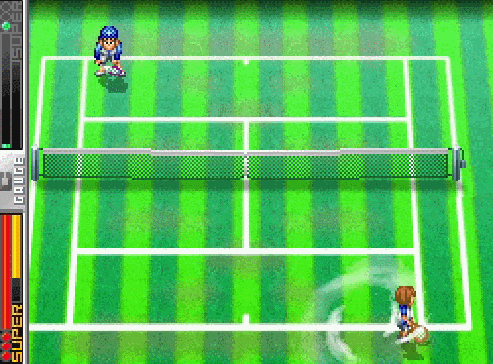

# Final Project Selection
After our initial team vote, we have narrowed our focus to two high-potential candidates. Each offers unique technical challenges and high engagement for the final demo.

## Option A: Vampire Survivors (Roguelike)

### Game Description
A top-down "reverse bullet hell" survival game. The player controls a single character moving through an endless field, while thousands of monsters swarm in. Weapons fire automatically, and the goal is to survive for a set duration while collecting experience points to level up.

### Mechanics
+ **Passive Interaction:** Players focus purely on positioning and movement; the shooting logic is handled by the system.
+ **XP & Leveling:** Enemies drop gems upon death. Collecting gems allows the player to choose new weapons or passive buffs from a randomized pool.
+ **Horde Spawning:** The game difficulty scales by increasing the density and health of the monster "swarms" over time.

### Technical Challenges
+ **Performance Optimization:** p5.js can struggle with thousands of objects.
+ **Object Pooling:** Frequent creation and deletion of bullet and enemy objects will trigger JavaScript's Garbage Collector, causing stutters.

### Game Twist
+ **Procedural Environment:** A Dynamic Level Generator that replaces the open grass field with automatically generated walls, corridors, and obstacles, forcing players to navigate tight spaces.

+ **Active Skill System:** Instead of purely passive gameplay, players can manually trigger powerful skills, transforming the experience from a simple idle-survivor into a tactical Action-RPG.

## Option B: Shuttle Smash (2D Racket Sports)

### Game Description
A high-paced 2D sports game that blends the physics of badminton and tennis with a strategic twist. Players compete in a 1v1 arena (Local Multiplayer or AI), aiming to outmaneuver their opponent through precise timing and the tactical use of specialized shot types.

### Mechanics
+ **Physics-Driven Movement:** Includes 2D lateral movement and jumping. The shuttlecock/ball utilizes a custom physics engine to simulate Gravity, Air Resistance (Drag), and Net Collisions.

+ **Dynamic Hitting System:** 
    + Timing-Based Quality: Hits are categorized as Early, Late, or Perfect, affecting the trajectory and speed.
    + Modular Shot Types: Players have access to specific techniques mapped to keys:
        + Topspin (Fast/Aggressive): High forward speed.
        + Slice (Slow/Tactical): Low gravity, drops near the net.
        + Lob (Defensive): High arc to clear opponents.
        + Smash (Ultimate): High-velocity downward strike (only usable on high balls).
+ **Stamina Management:** An active stamina gauge limits excessive sprinting or continuous heavy smashes, adding a layer of resource management.
+ **Scoring:** A simplified 21-point rally system (Badminton style) for fast-paced sessions.

### Technical Challenges
+ **Modular Skill System:** Building a modular system where new shot types (Topspin, Slice, etc.) can be added as independent classes without breaking the core physics engine.

+ **Precise Collision Handling:** Detecting high-speed interactions between the racket's "sweet spot" and the shuttlecock.

+ **Consistent Physics Logic:** Implementing drag and gravity that feel "natural" yet consistent for both players.

### Game Twist
The game features a Modular Ability System. Beyond basic tennis/badminton shots, each round can introduce environmental modifiers (like Wind Effects) or allow players to trigger Manual Special Moves (e.g., "Time-Slow" to catch a hard smash, or "Mirror Image" to create a fake shuttlecock).